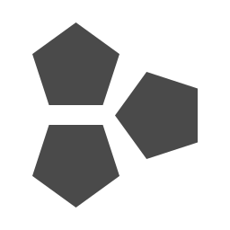
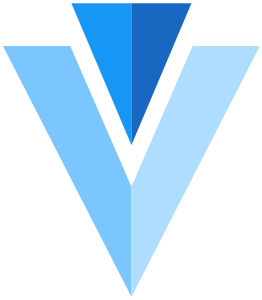
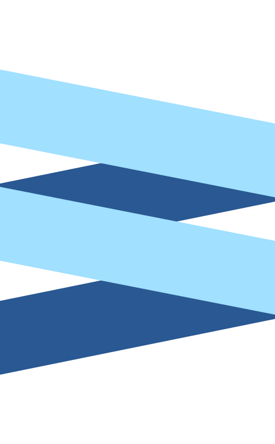

# awesome-uikit

## Awesome UI Kit

 \[]\(https://github.com/jaywcjlove/awesome-uikit/actions/工作流/ci.yml）

收集 JS 框架、Web 組件庫和管理模板。

          [< img src="https://web-cell.dev/WebCell-0.f1ffd28b.png" height="64px" />](https://github.com/EasyWebApp/WebCell)/assets/iview.png" height="64px" /> [\](https://github.com/vuetifyjs/vuetify)  /assets/iview.png" height="64px" /> [\](https://github.com/vuetifyjs/vuetify)  64px" />  [\</ a> ](https://github.com/ecomfe/san-mui)64px" />  [\</ a> ](https://github.com/ecomfe/san-mui)com/EasyWebApp/WebCell">com/EasyWebApp/WebCell">

### 內容

* [框架](./#frameworks)
  * [三巨頭](./#the-big-three)
  * [具有歷史意義的](./#historically-significant)
  * [值得注意](./#notable)
  * [手機](./#mobile)
  * [小程序](./#mini-program)
  * [其他人](./#rest-of-the-pack)
  * [反應狀態](./#state-of-the-react)
* [Web 組件](./#web-components)
  * [組件](./#components)
  * [工具](./#tools)
* [UI 組件](./#ui-components)
  * \[反應]（#反應）
  * [反應原生](./#react-native)
  * [Vue](./#vue)
  * \[角度]（#angular）
  * \[聖]（#聖）
  * [秘銀](./#mithril)
  * [WebCell](./#webcell)
  * [全押](./#全押)
  * [傳統](./#傳統)
* [移動 UI 組件](./#mobile-ui-components)
  * [反應](./#react-1)
  * [反應原生](./#react-native)
  * [Vue](./#vue-1)
  * [微信](./#wechat-1)
  * [傳統](./#tradition-1)
* [管理模板](./#admin-template)
  * [反應](./#react-2)
  * [Vue](./#vue-2)
  * \[角度]（#angular-1）
  * [其他](./#other)
* [工具](./#tools)
  * \[備忘單]（#備忘單）

**解釋**

!\[開源軟件]\[OSS Icon]表示**開源**，點擊進入**開源** repo；\
!\[hot]\[hot Icon] 表示**熱**；

＃＃ 構架

其中大部分來自：[JavaScript 框架終極指南](https://javascriptreport.com/the-ultimate-guide-to-javascript-frameworks/)

#### 三巨頭

* [反應](https://reactjs.org)   - 用於構建用戶界面的 JavaScript 庫。[!\[開源軟件\]\[OSS圖標\]](https://github.com/facebook/react)
* [角度](https://angular.io)   - 一個框架。移動和桌面。[!\[開源軟件\]\[OSS圖標\]](https://github.com/angular/angular)
* [Vue.js](https://vuejs.org)   - 一種漸進式、漸進式的 JavaScript用於在 Web 上構建 UI 的框架。[!\[開源軟件\]\[OSS圖標\]](https://github.com/vuejs/vue)

#### 具有歷史意義

* [AngularJS](https://angularjs.org)  - AngularJS - 為 Web 應用程序增強的 HTML！[!\[開源軟件\]\[OSS圖標\]](https://github.com/angular/angular.js)
* [Backbone](http://backbonejs.org)   - 給你的 JS 應用一些帶模型的主幹，視圖、集合和事件。[!\[開源軟件\]\[OSS圖標\]](https://github.com/jashkenas/backbone/)
* [Ember](https://www.emberjs.com)  - 用於創建雄心勃勃的 Web 應用程序的 JavaScript 框架。[!\[開源軟件\]\[OSS圖標\]](https://github.com/emberjs/ember.js)

\###值得注意

* [Aurelia](http://aurelia.io)  - Aurelia 允許我們專注於業務邏輯，而不是框架。[!\[開源軟件\]\[OSS圖標\]](https://github.com/aurelia)
* [anu](https://rubylouvre.github.io/anu/)  - React16-compat 迷你庫。[!\[開源軟件\]\[OSS圖標\]](https://github.com/RubyLouvre/anu)
* [榆樹](http://elm-lang.org)  - Elm 網站的服務器和客戶端代碼。[!\[開源軟件\]\[OSS圖標\]](https://github.com/elm/core)
* [FicusJS](https://docs.ficusjs.org)  - 使用 Web 組件開發應用程序的輕量級函數。[!\[開源軟件\]\[OSS圖標\]](https://github.com/ficusjs/ficusjs)
* [HTM](https://github.com/developit/htm)  - 使用標準標記模板的 JSX 替代方案，具有編譯器支持。[!\[開源軟件\]\[OSS圖標\]](https://github.com/developit/htm)
* [地獄](https://infernojs.org)  - 一個非常快速的、類似 React 的 JavaScript 庫，用於構建現代用戶界面。[!\[開源軟件\]\[OSS Icon\]](https://github.com/infernojs/inferno) !\[hot]\[hot Icon]
* [納米 JSX](https://github.com/yandeu/nano-jsx)  - 輕量級 1KB JSX 庫。[!\[開源軟件\]\[OSS圖標\]](https://github.com/yandeu/nano-jsx)
* [聚合物](https://www.polymer-project.org)  - 使用 Web 組件構建現代應用程序。[!\[開源軟件\]\[OSS圖標\]](https://github.com/Polymer/polymer)
* [Preact](https://preactjs.com)  - 具有相同現代 API 的快速 3kB React 替代方案。組件和虛擬 DOM。[!\[開源軟件\]\[OSS圖標\]](https://github.com/developit/preact/)
* [ReasonML](https://reasonml.github.io)  - 利用 JavaScript 和 OCaml 生態系統的簡單、快速和類型安全的代碼。[!\[開源軟件\]\[OSS圖標\]](https://github.com/facebook/reason)
* [Svelte](https://svelte.technology)  - 神奇的消失 UI 框架。[!\[開源軟件\]\[OSS Icon\]](https://github.com/sveltejs/svelte) !\[hot]\[hot Icon]
* [固體](https://github.com/ryansolid/solid)  - 用於構建用戶界面的聲明性、高效和靈活的 JavaScript 庫.. [!\[Open-Source Software\]\[OSS Icon\]](https://github.com/ryansolid/solid) ！ \[熱]\[熱圖標]

＃＃＃ 移動的

* [nativescript-vue](https://nativescript-vue.org)  - 具有 Vue 易用性的 NativeScript。[!\[開源軟件\]\[OSS圖標\]](https://github.com/nativescript-vue/nativescript-vue)
* [react-native](http://facebook.github.io/react-native/)  - 使用 React 構建原生應用程序的框架。[!\[開源軟件\]\[OSS Icon\]](https://github.com/facebook/react-native) !\[hot]\[hot Icon]
* [Weex](https://weex.apache.org)  - 用於構建移動跨平台 UI 的框架。[!\[開源軟件\]\[OSS圖標\]](https://github.com/apache/incubator-weex)

\###小程序

* [alita](https://areslabs.github.io/alita)  - 把 React Native 代碼轉換成微信小程序代碼的轉換引擎工具。 \[!\[開源軟件]\[OSS圖標]]\(https://github.com/skyFi/weapp -本國的）
* [Antmove](https://ant-move.github.io)  - 編譯型跨端解決方案，基於支付寶/微信小程序，輕鬆地轉換成其他平台的小程序。 \[!\[開源軟件]\[OSS圖標]]\(https ://github.com/ant-move/Antmove)
* [Anna Remax UI](https://ant-move.github.io/website/)  - 開發基於 Remax 框架的小程序 UI 組件庫。 \[!\[開源軟件]\[OSS Icon]\(https://github.com/ AnnaSearl/anna-remax-ui)
* [變色龍](http://cml.didi.cn) -  設置代碼運行多端，所見即多端所見\[!\[Open-Source Software][OSS Icon/chameleon](https://github.comdidi/chameleon)
* [mpx](https://didi.github.io/mpx/)  - 滴滴開源小程序框架。 [!\[開源軟件\]\[OSS圖標\]](https://github.com/didi/mpx)
* [mpvue](http://mpvue.com)  - 基於 Vue.js 的小程序框架，從支持 Vue.js 的語法和製作工具開發。 [!\[開源軟件\]\[OSS 圖標\]](https://github.com/%E7%BE%8E%E5%9C%98%E9%BB%9E%E8%A9%95/mpvue)
* [taro](https://taro.jd.com)  - 多端統一開發框架，支持小程序、H5、React Native等的應用。[!\[開源軟件\]\[OSS圖標\]](https://github.com/NervJS/taro)
* [weapp-native](https://github.com/skyFi/weapp-native)  - 像 React 一樣開發組件來開發微信小程序，開發微信小程序框架。 \[!\[Open-Source Software]\[OSS Icon]]\(https://github .com/skyFi/weapp-native)
* [wepy](https://tencent.github.io/wepy/)  - 小程序組件化開發框架。 [!\[開源軟件\]\[OSS圖標\]](https://github.com/Tencent/wepy)
* [Remax](https://remaxjs.org)  - 將 React 運行在小程序環境中，讓你可以使用完整的 React 進行開發。 [!\[Open-Source Software\]\[OSS Icon\]](https://github.com/remaxjs/remax)
* [uni-app](https://uniapp.dcloud.io)  使用Vue語法開發小程序、H5、App的統一框架[!\[開源軟件\]\[OSS圖標\]](https://github.com/dcloudio/uni-app)

#### 包的其餘部分

* [AppRun](https://yysun.github.com/apprun)  - AppRun 是一個使用 elm 架構、事件和組件開發的應用程序。[!\[開源軟件\]\[OSS圖標\]](https://github.com/yysun/apprun)
* [Atomico](https://github.com/UpperCod/Atomico)  - 一個小型 (1.6kB) 庫，用於處理 Web 組件。[!\[開源軟件\]\[OSS圖標\]](https://github.com/UpperCod/Atomico)
* [Binding.scala](https://github.com/ThoughtWorksInc/Binding.scala)  - Scala 的反應式數據綁定。[!\[開源軟件\]\[OSS圖標\]](https://github.com/ThoughtWorksInc/Binding.scala)
* [avalon](http://avalonjs.coding.me)  - 一個優雅高效的 express mvvm 框架。[!\[開源軟件\]\[OSS圖標\]](https://github.com/RubyLouvre/avalon)
* [Bobril](http://bobril.com)  - 具有虛擬 dom 的面向組件的框架（快速、穩定、帶有工具）。[!\[開源軟件\]\[OSS Icon\]](https://github.com/Bobris/Bobril) !\[hot]\[hot Icon]
* [Choo](https://choo.io)  - 堅固的 4kb 前端框架。[!\[開源軟件\]\[OSS圖標\]](https://github.com/choojs/choo)
* [Cycle.js](https://cycle.js.org)  - 用於可預測代碼的功能性和反應式 JavaScript 框架。[!\[開源軟件\]\[OSS圖標\]](https://github.com/cyclejs/cyclejs)
* [DIO](https://dio.js.org)  - 用於構建用戶界面的庫。[!\[開源軟件\]\[OSS Icon\]](https://github.com/thysultan/dio.js) !\[hot]\[hot Icon]
* [道場](https://dojo.io)  - 項目的元信息。[!\[開源軟件\]\[OSS圖標\]](https://github.com/dojo/meta)
* [Domvm](http://leeoniya.github.io/domvm/)  - DOM ViewModel - 一個輕薄、快速、無依賴的 vdom 視圖層。[!\[開源軟件\]\[OSS Icon\]](https://github.com/leeoniya/domvm) !\[hot]\[hot Icon]
* [dva](https://github.com/dvajs/dva)  - 基於 React 和 redux 的輕量級和 elm 風格的框架。[!\[開源軟件\]\[OSS圖標\]](https://github.com/dvajs/dva)
* [蝕刻](https://github.com/atom/etch)  - 使用簡單而明確的 API 圍繞 virtual-dom 構建組件。[!\[開源軟件\]\[OSS圖標\]](https://github.com/atom/etch)
* [esx](http://elm-lang.org)  - 類似於 JSX，但原生且快速。[!\[開源軟件\]\[OSS圖標\]](https://github.com/esxjs/esx)
* [Gruu](https://mareklabuz.github.io/gruu-docs/)  - 用於創建動態內容的 JavaScript 庫。[!\[開源軟件\]\[OSS圖標\]](https://github.com/MarekLabuz/gruu)
* [微光](https://glimmerjs.com)  - Glimmer.js 項目的中央存儲庫。[!\[開源軟件\]\[OSS圖標\]](https://github.com/glimmerjs/glimmer.js)
* [Hyperapp](https://hyperapp.js.org)  - 1 KB JavaScript 庫，用於構建 Web 應用程序。[!\[開源軟件\]\[OSS Icon\]](https://github.com/jorgebucaran/hyperapp) !\[hot]\[hot Icon]
* [Hyperdom](https://github.com/featurist/hyperdom)  - 一個快速、功能豐富且簡單的框架，用於構建動態瀏覽器應用程序。[!\[開源軟件\]\[OSS圖標\]](https://github.com/featurist/hyperdom)
* [hyperHTML](https://viperhtml.js.org)  - 一種快速輕量的虛擬 DOM 替代方案。[!\[開源軟件\]\[OSS圖標\]](https://github.com/WebReflection/hyperHTML)
* [Ivi](https://github.com/ivijs/ivi)  - 用於構建 Web 用戶界面的 Javascript (TypeScript) 庫。[!\[開源軟件\]\[OSS Icon\]](https://github.com/ivijs/ivi) !\[hot]\[hot Icon]
* [完整](https://javey.github.io/Intact)  - 一個可繼承的強邏輯模板前端 mvvm 框架。[!\[開源軟件\]\[OSS圖標\]](https://github.com/Javey/Intact)
* [淘汰賽](http://knockoutjs.com)  - Knockout 可以更輕鬆地使用 JavaScript 創建豐富的響應式 UI。[!\[開源軟件\]\[OSS圖標\]](https://github.com/knockout/knockout)
* [模型](https://maquettejs.org)  - 純粹簡單的虛擬 DOM 庫。[!\[開源軟件\]\[OSS圖標\]](https://github.com/AFASSoftware/maquette)
* [Marko](https://markojs.com)  - 來自 eBay 的友好（且快速！）的 UI 庫，它使構建 Web 應用程序變得有趣。[!\[開源軟件\]\[OSS圖標\]](https://github.com/marko-js/marko)
* [秘銀](https://mithril.js.org)  - 用於構建出色應用程序的 Javascript 框架。[!\[開源軟件\]\[OSS圖標\]](https://github.com/MithrilJS/mithril.js)
* [百萬](https://github.com/millionjs/million)  - <1kb 虛擬 DOM - 很快！[!\[開源軟件\]\[OSS圖標\]](https://github.com/millionjs/million)
* [月亮](http://moonjs.ga)  - 一個最小的、超快的 UI 庫。[!\[開源軟件\]\[OSS圖標\]](https://github.com/kbrsh/moon)
* [Maka.js](https://makajs.org)  - 一個可繼承的強邏輯模板前端 mvvm 框架。[!\[開源軟件\]\[OSS圖標\]](https://github.com/makajs/maka)
* [神經](https://nerv.aotu.io)  - 超快的 React 替代方案，兼容 IE8 和 React 16。[!\[Open-Source Software\]\[OSS Icon\]](https://github.com/NervJS/nerv)
* [NX](http://www.nx-framework.com)  - 一個模塊化的前端框架 - 受服務器端和 Web 組件的啟發。[!\[開源軟件\]\[OSS圖標\]](https://github.com/nx-js/framework)
* [petit-dom](https://github.com/yelouafi/petit-dom)  - 極簡的虛擬 dom 庫。[!\[開源軟件\]\[OSS Icon\]](https://github.com/yelouafi/petit-dom) !\[hot]\[hot Icon]
* [Picodom](https://github.com/picodom/picodom)  - 1 KB VDOM 構建器和補丁功能。[!\[開源軟件\]\[OSS Icon\]](https://github.com/picodom/picodom) !\[hot]\[hot Icon]
* [Pux](http://purescript-pux.org)  - 使用 PureScript 構建類型安全的 Web 應用程序。[!\[開源軟件\]\[OSS圖標\]](https://github.com/alexmingoia/purescript-pux/)
* [Ractive](https://ractive.js.org)  - 下一代 DOM 操作。[!\[開源軟件\]\[OSS圖標\]](https://github.com/ractivejs/ractive)
* [react-lite](https://github.com/Lucifier129/react-lite)  - React 的實現，優化了小腳本大小。[!\[開源軟件\]\[OSS圖標\]](https://github.com/Lucifier129/react-lite)
* [RE:DOM](https://redom.js.org)  - 用於創建用戶界面的微型 (2 KB) 渦輪增壓 JavaScript 庫。[!\[開源軟件\]\[OSS Icon\]](https://github.com/redom/redom) !\[hot]\[hot Icon]
* [反射](https://github.com/mozilla/reflex)  - 功能反應式 UI 庫。[!\[開源軟件\]\[OSS圖標\]](https://github.com/mozilla/reflex)
* [防暴](http://riotjs.com)  - 簡單優雅的基於組件的 UI 庫。[!\[開源軟件\]\[OSS圖標\]](https://github.com/riot/riot)
* [rxdomh](https://github.com/xialvjun/rx-domh)  - 創建 DOM 元素並在其上綁定 observables。[!\[開源軟件\]\[OSS圖標\]](https://github.com/xialvjun/rx-domh)
* [聖](https://ecomfe.github.io/san/)  - 一個靈活的 JavaScript 組件框架。[!\[開源軟件\]\[OSS圖標\]](https://github.com/ecomfe/san)
* [Simulacra.js](https://simulacra.js.org)  - DOM 的數據綁定函數。[!\[開源軟件\]\[OSS圖標\]](https://github.com/daliwali/simulacra)
* [Slim.js](http://slimjs.com)  - 基於現代標準的快速且強大的前端微框架。[!\[開源軟件\]\[OSS圖標\]](https://github.com/eavichay/slim.js)
* [STEM.JS](https://stemjs.org)  - 另一個 javascript 框架。[!\[開源軟件\]\[OSS圖標\]](https://github.com/mciucu/stemjs)
* [剩餘](https://github.com/adamhaile/surplus)  - S.js 應用程序的高性能 JSX Web 視圖。[!\[開源軟件\]\[OSS Icon\]](https://github.com/adamhaile/surplus) !\[hot]\[hot Icon]
* [Thermite](https://github.com/paf31/purescript-thermite)  - React 的簡單 PureScript 包裝器。[!\[開源軟件\]\[OSS圖標\]](https://github.com/paf31/purescript-thermite)
* [TSERS](https://github.com/tsers-js/core)  - 反應式流的轉換信號執行器框架。[!\[開源軟件\]\[OSS圖標\]](https://github.com/tsers-js/core)
* [Vidom](https://github.com/dfilatov/vidom)  - 基於虛擬 DOM 構建 UI 的庫。[!\[開源軟件\]\[OSS圖標\]](https://github.com/dfilatov/vidom)
* [Vuera](https://github.com/akxcv/vuera)  - React 中的 Vue，Vue 中的 React。兩者無縫融合。[!\[開源軟件\]\[OSS圖標\]](https://github.com/akxcv/vuera)
* [WebCell](https://web-cell.dev)  - 基於 JSX & TypeScript 的 Web 組件引擎 [!\[Open-Source Software\]\[OSS Icon\]](https://github.com/EasyWebApp/WebCell)

#### 反應狀態

* [Constate](https://github.com/diegohaz/constate)  - 反應上下文 + 狀態。[!\[開源軟件\]\[OSS圖標\]](https://github.com/diegohaz/constate)
* [Easy Peasy](https://easy-peasy.dev)  - React 的素食友好狀態。[!\[開源軟件\]\[OSS圖標\]](https://github.com/ctrlplusb/easy-peasy)
* [Hox](https://github.com/umijs/hox)  - React 的下一代狀態管理器。[!\[開源軟件\]\[OSS圖標\]](https://github.com/umijs/hox)
* [冰庫](https://github.com/ice-lab/icestore)  - React 的下一代狀態管理器。[!\[開源軟件\]\[OSS圖標\]](https://github.com/ice-lab/icestore)
* [Jotai](https://jotai.pmnd.rs)  - React 的原始和靈活的狀態管理。[!\[開源軟件\]\[OSS圖標\]](https://github.com/pmndrs/jotai)
* [MobX](http://mobx.js.org)  - 簡單、可擴展的狀態管理。[!\[開源軟件\]\[OSS圖標\]](https://github.com/mobxjs/mobx)
* [React Easy State](https://github.com/RisingStack/react-easy-state)  - 簡單的 React 狀態管理。使用❤️ 和 ES6 代理製作。[!\[開源軟件\]\[OSS圖標\]](https://github.com/RisingStack/react-easy-state)
* [Redux 工具包](https://redux-toolkit.js.org)  - 官方的、固執己見的、包含電池的工具集，用於高效的 Redux 開發 \[!\[Open-Source Software]\[OSS Icon]]\(https://github.com/reduxjs/redux -工具包）
* [react-hooks-global-state](https://github.com/dai-shi/react-hooks-global-state)  - React 的簡單全局狀態與 Hooks API 沒有上下文 API。[!\[開源軟件\]\[OSS圖標\]](https://github.com/dai-shi/react-hooks-global-state)
* [重新匹配](https://github.com/rematch/rematch)  - 使用狀態圖進行狀態管理.. [!\[Open-Source Software\]\[OSS Icon\]](https://github.com/rematch/rematch)
* [Unistore](https://github.com/developit/unistore)  - 350b/650b 狀態容器，帶有用於 Preact 和 React 的組件操作。[!\[開源軟件\]\[OSS圖標\]](https://github.com/developit/unistore)
* [unstated-next](https://jotai.pmnd.rs)  - 200 字節，不再考慮 React 狀態管理庫。[!\[開源軟件\]\[OSS圖標\]](https://github.com/jamiebuilds/unstated-next)
* [useStateMachine](https://github.com/cassiozen/useStateMachine)  - React 的 ½ kb 狀態機鉤子。[!\[開源軟件\]\[OSS圖標\]](https://github.com/cassiozen/useStateMachine)
* [Valtio](http://valtio-demo.pmnd.rs)  - Valtio 使 React 和 Vanilla 的代理狀態變得簡單。[!\[開源軟件\]\[OSS圖標\]](https://github.com/pmndrs/valtio)
* [zustand](https://zustand.surge.sh)  - 承擔 React 中狀態管理的必需品。[!\[開源軟件\]\[OSS圖標\]](https://github.com/pmndrs/zustand)

### Web 組件

＃＃＃ 組件

* [amp](https://amp.dev)  - AMP Web 組件框架。[!\[開源軟件\]\[OSS圖標\]](https://github.com/ampproject/amphtml)
* [螺栓](https://github.com/boltdesignsystem/bolt)  Bolt 設計系統提供了強大的 Twig 和 Web 組件。[!\[開源軟件\]\[OSS圖標\]](https://github.com/boltdesignsystem/bolt)
* [清晰度](http://clarity.design)  - Clarity 是一個開源設計系統，它將 UX 指南、設計資源和編碼實現與 Web 組件結合在一起。[!\[開源軟件\]\[OSS圖標\]](https://github.com/vmware/clarity)
* [材質網](https://material-components.github.io/material-web/demos/)  - Material Design Web 組件。[!\[開源軟件\]\[OSS圖標\]](https://github.com/material-components/material-web)
* [快速](https://fast.design)  - 現代網絡體驗的自適應界面系統。[!\[開源軟件\]\[OSS圖標\]](https://github.com/microsoft/fast)
* [獅子](https://lion-web.netlify.app)  - 設計系統的基本白標 Web 組件功能.. \[!\[Open-Source Software]\[OSS Icon]]\(https://github.com/ing-bank /獅子）
* [鞋帶](https://shoelace.style)  - 一組專業設計的、基於與框架無關的技術構建的日常 UI 組件。[!\[開源軟件\]\[OSS圖標\]](https://github.com/shoelace-style/shoelace)
* [UI5 Web 組件](https://sap.github.io/ui5-webcomponents/)  - 原生 API 之上的企業級糖。[!\[開源軟件\]\[OSS圖標\]](https://github.com/SAP/ui5-webcomponents)
* [有線元素](https://wiredjs.com)  - 出現手繪的自定義元素的集合。非常適合線框或有趣的外觀。[!\[開源軟件\]\[OSS圖標\]](https://github.com/rough-stuff/wired-elements)
* [xy-ui](https://xy-ui.codelabo.cn/docs)  - 給未來的Java組件UI組件庫[!\[Open-Source Software\]\[OSS Icon\]](https://github.com/XboxYan/xy)

＃＃＃ 工具

* [Corpuscule](https://corpusculejs.github.io/corpuscule)  - 基於裝飾器的小型 Web 組件框架。[!\[開源軟件\]\[OSS圖標\]](https://github.com/corpusculejs/corpuscule)
* [DNA](https://www.chialab.io/p/dna)  - 漸進式 Web 組件庫。[!\[開源軟件\]\[OSS圖標\]](https://github.com/chialab/dna)
* [jsx-for-web-components](https://github.com/slogsdon/jsx-for-web-components)  - 一個基本的 JSX 工廠，用於利用 Web 組件的項目。[!\[開源軟件\]\[OSS圖標\]](https://github.com/slogsdon/jsx-for-web-components)
* [LWC](https://lwc.dev)  - 超快的企業級 Web 組件基礎。[!\[開源軟件\]\[OSS圖標\]](https://github.com/salesforce/lwc)
* [點燃](https://lit.dev)  - Lit 是一個簡單的庫，用於構建快速、輕量級的 Web 組件。[!\[開源軟件\]\[OSS圖標\]](https://github.com/lit/lit)
* [面板](https://github.com/mixpanel/panel)  - Web 組件 + 虛擬 DOM：強大 UI 的 Web 標準。[!\[開源軟件\]\[OSS圖標\]](https://github.com/mixpanel/panel)
* [模板](https://stenciljs.com)  - 用於在 TypeScript 和 Web 組件標準之上構建可擴展、企業級組件系統的工具鏈。[!\[開源軟件\]\[OSS圖標\]](https://github.com/ionic-team/stencil)
* [滑板](http://skatejs.netlify.com)  - 由現代視圖庫提供支持的輕鬆自定義元素。[!\[開源軟件\]\[OSS圖標\]](https://github.com/skatejs/skatejs)
* [slim.js](https://slimjs.com)  - 基於現代標準的快速且強大的前端微框架。[!\[開源軟件\]\[OSS圖標\]](https://github.com/slimjs/slim.js)
* [補品](https://tonicframework.dev)  - 一個低調的組件框架 - 穩定、最小、易於審計、零依賴和無構建工具。[!\[開源軟件\]\[OSS圖標\]](https://github.com/socketsupply/tonic)

### UI 組件

#### 反應

 _\[React]\(https:// /github.com/facebook/react) 基於組件庫。_

* [uiw](http://uiwjs.github.io)  - 一個高質量的 UI 工具包，一個 React 組件庫。[!\[開源軟件\]\[OSS圖標\]](https://github.com/uiwjs/uiw)
* [AgnosticUI](https://www.agnosticui.com)  - 適用於 React、Vue 3、Svelte 和 Angular 的可訪問組件基元 [!\[Open-Source Software\]\[OSS Icon\]](https://github.com/agnosticui/agnosticui)
* [ANT DESIGN](https://ant.design/index-cn)  - 一種 UI 設計語言。[!\[開源軟件\]\[OSS圖標\]](https://github.com/ant-design/ant-design)
* [Arco 設計](https://arco.design)  - 一個全面的 React UI 組件庫。[!\[開源軟件\]\[OSS圖標\]](https://github.com/arco-design/arco-design)
* [Atlassian UI](https://atlaskit.atlassian.com) Atlassian 的官方 UI 庫，根據 Atlassian 設計指南構建。[!\[開源軟件\]\[OSS圖標\]](https://bitbucket.org/atlassian/atlaskit-mk-2)
* [Amaze UI React](http://amazeui.org/react/)  - 使用 React.js 構建的 Amaze UI 組件。[!\[開源軟件\]\[OSS圖標\]](https://github.com/amazeui/amazeui-react)
* [Arwes](https://arwes.dev)  - 用於 Web 應用程序的未來科幻和賽博朋克圖形用戶界面框架。[!\[開源軟件\]\[OSS圖標\]](https://github.com/arwesjs/arwes)
* [背包](https://backpack.github.io)  - 背包設計系統。[!\[開源軟件\]\[OSS圖標\]](https://github.com/Skyscanner/backpack)
* [基礎 UI](https://baseweb.design)  - 基礎 Web React 組件。[!\[開源軟件\]\[OSS圖標\]](https://github.com/uber-web/baseui)
* [藍圖](http://blueprintjs.com)  - Blueprint 是一個基於 React 的 Web UI 工具包。[!\[開源軟件\]\[OSS圖標\]](https://github.com/palantir/blueprint)
* [綻放](https://bloom.appearhere.co.uk)  - Bloom 充當可重用 React 組件的中央存儲庫。[!\[開源軟件\]\[OSS圖標\]](https://github.com/appearhere/bloom)
* [美女](http://nikgraf.github.io/belle/)  - 具有出色 UX 的可配置 React 組件。[!\[開源軟件\]\[OSS圖標\]](https://github.com/nikgraf/belle)
* [藍色](https://github.com/helpscout/blue)  - 為企業應用而生的 React UI 組件套件。[!\[開源軟件\]\[OSS圖標\]](https://github.com/helpscout/blue)
* [Buttercup UI](https://buttercup.pw)  - 在 Buttercup 產品中使用的 React UI 組件。[!\[開源軟件\]\[OSS圖標\]](https://github.com/buttercup/ui)
* [碳](http://react.carbondesignsystem.com)  - 根據 IBM 的 React 組件。[!\[開源軟件\]\[OSS圖標\]](https://github.com/IBM/carbon-components-react)
* [脈輪](https://chakra-ui.com)  - 用於 React 應用程序的簡單、模塊化和可訪問的 UI 組件。[!\[開源軟件\]\[OSS圖標\]](https://github.com/chakra-ui/chakra-ui)
* [ChatUI](https://chatui.io)  - 對話式 UI 的 UI 設計語言和 React 庫。[!\[開源軟件\]\[OSS圖標\]](https://github.com/alibaba/ChatUI)
* [cloud-react](https://cloud-react.shuyun.com)  - 數雲PC端react基礎組件。 [!\[開源軟件\]\[OSS圖標\]](https://github.com/ShuyunFF2E/cloud-react)
* [設計塊](https://www.froala.com/design-blocks)  - Froala 設計塊的 React 實現。[!\[開源軟件\]\[OSS圖標\]](https://github.com/froala/react-froala-design-blocks)
* [常青樹](https://segmentio.github.io/evergreen/)  -Evergreen React UI 框架，按分段。[!\[開源軟件\]\[OSS圖標\]](https://github.com/segmentio/evergreen)
* [EBS 設計系統](https://github.com/ebs-integrator/ebs-design)  - 用於企業級應用程序的基於 React 的 UI 工具包。[!\[開源軟件\]\[OSS圖標\]](https://github.com/ebs-integrator/ebs-design)
* [元素反應](https://elemefe.github.io/element-react/)  - 用 React 編寫的基本 UI 組件的集合。[!\[開源軟件\]\[OSS圖標\]](https://github.com/ElemeFE/element-react)
* [ExtReact](https://www.sencha.com/products/extreact/)  - 在 React 中使用 Ext JS 組件。[!\[開源軟件\]\[OSS圖標\]](https://github.com/sencha/ext-react)
* [Fannypack](https://fannypack.style)  - 使用 Reakit 構建的友好、可主題化、可訪問的 React UI 工具包。[!\[開源軟件\]\[OSS圖標\]](https://github.com/fannypackui/fannypack)
* [基礎](https://react.foundation)  - 基礎作為 React 組件。[!\[開源軟件\]\[OSS圖標\]](https://github.com/nordsoftware/react-foundation)
* [Fyndiq UI](https://fyndiq.github.io/fyndiq-ui)  -Fyndiq 的可重用組件庫。[!\[開源軟件\]\[OSS圖標\]](https://github.com/fyndiq/fyndiq-ui)
* [融合設計](https://fusion.design)  - 基於 React 的可配置 Web 組件庫。[!\[開源軟件\]\[OSS圖標\]](https://github.com/alibaba-fusion/next)
* [元素 UI](http://elemental-ui.com)  - React.js 的靈活美觀的 UI 框架。[!\[開源軟件\]\[OSS圖標\]](https://github.com/elementalui/elemental)
* [花園](https://garden.zendesk.com/react-components/)  - 基於花園 css 的花園 React 組件。[!\[開源軟件\]\[OSS圖標\]](https://github.com/zendeskgarden/react-components)
* [Geist UI](https://react.geist-ui.dev)  - 現代簡約的 React UI 庫。[!\[開源軟件\]\[OSS圖標\]](https://github.com/geist-org/react)
* [格式塔](https://pinterest.github.io/gestalt/)  - 一組支持 Pinterest 設計語言的 React UI 組件。[!\[開源軟件\]\[OSS圖標\]](https://github.com/pinterest/gestalt)
* [govuk-react](https://github.com/govuk-react/govuk-react/)  - 使用 CSSinJS 在 React 中實現 GOV.UK 設計系統。[!\[開源軟件\]\[OSS圖標\]](https://github.com/govuk-react/govuk-react)
* [索環](https://v2.grommet.io)  - 專注於基本體驗。[!\[開源軟件\]\[OSS圖標\]](https://github.com/grommet/grommet)
* [黑客俱樂部設計系統](https://design.hackclub.com)  - 具有 nijigen 風格的反應 UIKit。[!\[開源軟件\]\[OSS圖標\]](https://github.com/hackclub/design-system)
* [hana-ui](https://hana-ui.moe)  - 具有 nijigen 風格的反應 UIKit。[!\[開源軟件\]\[OSS圖標\]](https://github.com/hana-group/hana-ui)
* [HIUI](https://xiaomi.github.io/hiui/)  這是一個足以製定和實現前、中、後端交互和UI設計標準的解決方案。[!\[開源軟件\]\[OSS圖標\]](https://github.com/XiaoMi/hiui)
* [結構 UI​​](https://instructure.design)  - Instructure, Inc. 製作的 UI 組件庫 [!\[Open-Source Software\]\[OSS Icon\]](https://github.com/instructure/instructure-ui)
* [ICE DISIGN](https://alibaba.github.io/ice/)  - 海量可多種物料速遞，通過 GUI 工具極製造中的後台應用。[!\[開源軟件\]\[OSS圖標\]](https://github.com/alibaba/ice)
* [Klarna UI](https://klarna.github.io/ui/)  - Klarna 的 UI 組件庫。[!\[開源軟件\]\[OSS圖標\]](https://github.com/klarna/ui)
* [KhanAcademy React](http://khan.github.io/react-components/)  - Klarna 的 UI 組件庫。[!\[開源軟件\]\[OSS圖標\]](https://github.com/Khan/react-components)
* [Lodgify](https://lodgify.github.io/lodgify-ui/)  - 使用 Lodgify 構建令人驚嘆的網站的 React 組件。[!\[開源軟件\]\[OSS圖標\]](https://github.com/lodgify/lodgify-ui)
* [材質-UI](http://www.material-ui.com/#/)  - 實現 Google 的 Material Design 的 React 組件。[!\[開源軟件\]\[OSS圖標\]](https://github.com/callemall/material-ui)
* [模塊 UI](https://brcportal2.github.io/modul-ui/)  - 模塊化 UI React 組件。[!\[開源軟件\]\[OSS圖標\]](https://github.com/brcportal2/modul-ui)
* [MDBootstrap](https://mdbootstrap.com/docs/react/)  - 使用 Material Design 反應 Bootstrap。[!\[開源軟件\]\[OSS圖標\]](https://github.com/mdbootstrap/React-Bootstrap-with-Material-Design)
* [Mantine](https://mantine.dev)  - 具有原生深色主題支持的 React 組件庫。[!\[開源軟件\]\[OSS圖標\]](https://github.com/mantinedev/mantine)
* [nice-react](https://nice.textkernel.nl/react/)  - React Bootstrap 與 Material Design。[!\[開源軟件\]\[OSS圖標\]](https://github.com/textkernel/nice-react)
* [Office UI Fabric](https://developer.microsoft.com/en-us/fabric)  - 用於構建 Office 和 Office 365 體驗的 React 組件。\[!\[開源軟件]\[OSS 圖標]]\(https://github .com/OfficeDev/office-ui-fabric-react)
* [軌道](https://orbit.kiwi)  - Kiwi.com 的 Orbit 組件的公共存儲庫。[!\[開源軟件\]\[OSS圖標\]](https://github.com/kiwicom/orbit-components)
* [oneui](https://open-ui.org)  - 可重用 UI 組件的 Textkernel OneUI 庫。[!\[開源軟件\]\[OSS圖標\]](https://github.com/textkernel/oneui)
* [打開 UI](https://textkernel.github.io/oneui/)  - 可重用 UI 組件的 Textkernel OneUI 庫。[!\[開源軟件\]\[OSS圖標\]](https://github.com/openui/open-ui)
* [PatternFly React](https://www.patternfly.org)  - PatternFly 項目的一組 React 組件。[!\[開源軟件\]\[OSS圖標\]](https://github.com/patternfly/patternfly-react)
* [Polaris React](https://polaris.shopify.com)  - Shopify 的產品組件庫。[!\[開源軟件\]\[OSS圖標\]](https://github.com/Shopify/polaris)
* [Pivotal UI](https://styleguide.pivotal.io)  - Pivotal UI 是一組為 Pivotal 品牌設計的 React 組件。[!\[開源軟件\]\[OSS圖標\]](https://github.com/pivotal-cf/pivotal-ui)
* [Prime React](https://www.primefaces.org/primereact)  - 是 React 豐富的 UI 組件的集合。[!\[開源軟件\]\[OSS圖標\]](https://github.com/primefaces/primereact)
* [底漆](https://primer.style)  - 入門 React 組件。[!\[開源軟件\]\[OSS圖標\]](https://github.com/primer/components)
* [精確用戶界面](https://precise-ui.io)  - 由蔡司提供支持的 React UI 組件庫。[!\[開源軟件\]\[OSS圖標\]](https://github.com/ZEISS/precise-ui)
* [rbx](https://dfee.github.io/rbx/)  - React 的綜合 Bulma UI 框架。[!\[開源軟件\]\[OSS圖標\]](https://github.com/dfee/rbx)
* [reactjs-components](http://mesosphere.github.io/reactjs-components/)  - 可重用的 React 組件庫。[!\[開源軟件\]\[OSS圖標\]](https://github.com/mesosphere/reactjs-components)
* [reactstrap](https://reactstrap.github.io)  - 簡單的 React Bootstrap 4 組件。[!\[開源軟件\]\[OSS圖標\]](https://github.com/reactstrap/reactstrap)
* [Reakit](https://reakit.io)  - 使用 React 構建真正交互式 UI 的工具包。[!\[開源軟件\]\[OSS圖標\]](https://github.com/reakit/rekit)
* [React95](https://react95.github.io/React95/)  - 帶有 Win95 UI 的 React 組件庫。[!\[開源軟件\]\[OSS圖標\]](https://github.com/React95/React95)
* [RSUITE](https://rsuitejs.com)  - 一套 React 組件。[!\[開源軟件\]\[OSS圖標\]](https://github.com/rsuite/rsuite)
* [反應光譜](https://react-spectrum.adobe.com/react-spectrum/)  - 幫助您構建自適應、可訪問和強大的用戶體驗的庫和工具的集合。來自 Adob​​e。[!\[開源軟件\]\[OSS圖標\]](https://github.com/adobe/react-spectrum)
* [基元](https://www.radix-ui.com)  - 一個開源 UI 組件庫，用於構建高質量、可訪問的設計系統和 Web 應用程序。[!\[開源軟件\]\[OSS圖標\]](https://github.com/radix-ui/primitives)
* [React Material Web 組件](https://jamesmfriedman.github.io/rmwc/)  - JetBrains Web UI 組件的集合。[!\[開源軟件\]\[OSS圖標\]](https://github.com/jamesmfriedman/rmwc)
* [環 UI](https://jetbrains.org/ring-ui/index.html)  - JetBrains Web UI 組件的集合。[!\[開源軟件\]\[OSS圖標\]](https://github.com/JetBrains/ring-ui)
* [反應 UI](http://lobos.github.io/react-ui/)  - React 組件，基於 bootstrap 4.0。[!\[開源軟件\]\[OSS圖標\]](https://github.com/Lobos/react-ui)
* [React-Bootstrap](https://react-bootstrap.github.io)  - 最流行的前端框架，為 React 重建。[!\[開源軟件\]\[OSS圖標\]](https://github.com/react-bootstrap/react-bootstrap)
* [重啟 UI](https://react-restart.github.io/ui/)  - 一組功能齊全、可擴展且可訪問的 UI 組件，旨在集成到任何樣式框架或系統中。[!\[開源軟件\]\[OSS圖標\]](https://github.com/react-restart/ui)
* [反應引導](https://reactstrap.github.io)  - 簡單的 React Bootstrap 4 組件。[!\[開源軟件\]\[OSS圖標\]](https://github.com/reactstrap/reactstrap)
* [React 桌面](http://reactdesktop.js.org)  - 適用於 macOS High Sierra 和 Windows 10 的 React UI 組件。[!\[Open-Source Software\]\[OSS Icon\]](https://github.com/gabrielbull/react-desktop)
* [react-materialize](https://react-materialize.github.io)  - 反應的材料設計，由 materializecss 提供支持。[!\[開源軟件\]\[OSS圖標\]](https://github.com/react-materialize/react-materialize)
* [React-md](https://react-md.mlaursen.com)  - React Material Design - 使用 sass 構建的 React 組件。[!\[開源軟件\]\[OSS圖標\]](https://github.com/mlaursen/react-md)
* [反應離子](http://reactionic.github.io)  - React Ionic：我們正在尋找新的維護者！[!\[開源軟件\]\[OSS圖標\]](https://github.com/reactionic/reactionic)
* [React 響應式 UI](https://catamphetamine.github.io/react-responsive-ui)  - 響應式 React UI 組件！[!\[開源軟件\]\[OSS圖標\]](https://github.com/catamphetamine/react-responsive-ui)
* [React-WeUI](https://weui.github.io/react-weui/docs/)  - 使用 React 編寫的基本 UI 組件的集合。[!\[開源軟件\]\[OSS圖標\]](https://github.com/weui/react-weui/)
* [React-UWP](https://www.react-uwp.com)  - 實現微軟 UWP 設計和流暢設計的 React 組件。[!\[開源軟件\]\[OSS圖標\]](https://github.com/reactionic/reactionic)
* [React 工具箱](http://react-toolbox.io)  - 是一組實現 Google 的 Material Design 規範的 React 組件。[!\[開源軟件\]\[OSS圖標\]](https://github.com/react-toolbox/react-toolbox)
* [Reach UI](https://ui.reach.tech)  - React 應用程序和設計系統的無障礙基礎。[!\[開源軟件\]\[OSS圖標\]](https://github.com/reach/reach-ui)
* [編輯](https://balena-io-modules.github.io/rendition/)  - React UI 組件庫。[!\[開源軟件\]\[OSS圖標\]](https://github.com/balena-io-modules/rendition)
* [Rebass](https://rebassjs.org)  - 功能性 React UI 組件庫，使用 styled-components 構建。[!\[開源軟件\]\[OSS圖標\]](https://github.com/rebassjs/rebass)
* [react-uikit-components](http://kbuechl.github.io/react-uikit-components/)  - 用於 UIKit CSS 框架的 React UIkit 組件。[!\[開源軟件\]\[OSS圖標\]](https://github.com/kbuechl/react-uikit-components)
* [Sancho UI](https://sancho-ui.com)  - 可主題化的 React 組件庫。[!\[開源軟件\]\[OSS圖標\]](https://github.com/bmcmahen/sancho)
* [星塵界面](https://stardust-ui.github.io/react/)  - 可主題化的 React 組件庫。[!\[開源軟件\]\[OSS圖標\]](https://github.com/stardust-ui/react)
* [Shineout](https://sheinsight.github.io/shineout)  - React 的組件庫。[!\[開源軟件\]\[OSS圖標\]](https://github.com/sheinsight/shineout)
* [語義 UI](https://react.semantic-ui.com)  - 官方 Semantic-UI-React 集成。[!\[開源軟件\]\[OSS圖標\]](https://github.com/Semantic-Org/Semantic-UI-React)
* [平滑 UI](https://smooth-ui.smooth-code.com)  - 現代 React UI 庫。少寫代碼，多做事。[!\[開源軟件\]\[OSS圖標\]](https://github.com/smooth-code/smooth-ui)
* [智能反應組件](https://cevadtokatli.github.io/smart-react-components/)  - 用於樣式化組件的 React UI 庫。[!\[開源軟件\]\[OSS圖標\]](https://github.com/cevadtokatli/smart-react-components)
* [超級調度 UI](https://ui.superdispatch.org)  - 網頁設計系統。[!\[開源軟件\]\[OSS圖標\]](https://github.com/superdispatch/web-ui)
* [UXCore](http://uxco.re)  - 適用於企業應用程序的 React UI 組件套件。[!\[開源軟件\]\[OSS圖標\]](https://github.com/uxcore/uxcore)
* [tinper-bee](http://bee.tinper.org)  基於 UI 設計語言 iUAP Design 和 React 的組件庫。[!\[開源軟件\]\[OSS圖標\]](https://github.com/iuap-design/tinper-bee)
* [Tenon-ui](https://tenon-ui.info)  - Tenon 可訪問的 ui 組件庫。[!\[開源軟件\]\[OSS圖標\]](https://github.com/tenon-io/tenon-ui)
* [主題 UI](https://theme-ui.com)  - 基於基於約束的設計原則構建一致的、可主題化的 React 應用程序。[!\[開源軟件\]\[OSS圖標\]](https://github.com/system-ui/theme-ui)
* [Tiny UI](https://tiny-ui.dev)  - 為 React.js 設置的友好 UI 組件 [!\[Open-Source Software\]\[OSS Icon\]](https://github.com/wangdicoder/tiny-ui)
* [Yoshino-UI](https://yoshino-ui.github.io)  - 一個基於 React 的可定制化的 pc 端組件庫。[!\[開源軟件\]\[OSS圖標\]](https://github.com/Yoshino-UI/Yoshino)
* [Zent](https://www.youzanyun.com/zanui/zent)  - 用 React 編寫的基本 UI 組件的集合。[!\[開源軟件\]\[OSS圖標\]](https://github.com/youzan/zent)
* [零用戶界面](https://alphago88.github.io/Zero-UI/)  - 一個易於使用的 Web UI 組件框架。[!\[開源軟件\]\[OSS圖標\]](https://github.com/AlphaGo88/Zero-UI)
* [Zarm Web](https://zarm-web.netlify.com)  - Web UI 組件框架。[!\[開源軟件\]\[OSS圖標\]](https://github.com/JeromeLin/zarm-web)
* [zhui](https://zhui-team.github.io/zhui/)  - react 的中式組件庫。[!\[開源軟件\]\[OSS圖標\]](https://github.com/zhui-team/zhui)

#### Vue

 _\[Vue]\(https:// /github.com/vuejs/vue) 基於組件庫。_

* [Ant Design Vue](https://vuecomponent.github.io/ant-design-vue)  - VueJS 的碳設計。[!\[開源軟件\]\[OSS圖標\]](https://github.com/vueComponent/ant-design-vue)
* [at-ui](https://at.aotu.io)  - 一個清新扁平的 UI-Kit，專門用於桌面應用程序，由 ♥ 由 Vue.js 2.0 製作。[!\[開源軟件\]\[OSS圖標\]](https://github.com/AT-UI/at-ui)
* [amaze-vue](https://smokingrabbit.github.io/amaze-vue/)  - 用於 Web 的 UI 工具包，Vue2.0 .\[!\[開源軟件]\[OSS 圖標]]\(https://github.com/SmokingRabbit/amaze- vue)
* [ATUI](https://aliqin.github.io/atui/)  - 適用於 Web 的 Vue.js 2.0 UI 工具包。[!\[開源軟件\]\[OSS圖標\]](https://github.com/aliqin/atui)
* [Antue](https://zzuu666.github.io/antue/)  - 一組企業級 Vue UI 組件。[!\[開源軟件\]\[OSS圖標\]](https://github.com/zzuu666/antue)
* [bootstrap-vue](https://bootstrap-vue.github.io)  - Vue.js 2 \[bootstrap-4]\(http s://getbootstrap.com/) 網格和組件的實現。 [!\[開源軟件\] \[OSS 圖標\]](https://github.com/bootstrap-vue/bootstrap-vue)
* [Buefy](https://buefy.org)  - Vuejs 2.0 的 Material Design UI 庫。[!\[開源軟件\]\[OSS圖標\]](https://github.com/buefy/buefy)
* [BalmUI](https://material.balmjs.com)  - Vue.js 的下一代 Material UI。[!\[開源軟件\]\[OSS圖標\]](https://github.com/balmjs/ui-vue)
* [Carvue.js](https://carvuejs.github.io)  - VueJS 的碳設計。[!\[開源軟件\]\[OSS圖標\]](https://github.com/CarvueJS/carbon-components-vue)
* [DaisyUI](https://daisyui.com)  - 將 btn、card 等組件類添加到 Tailwind CSS。[!\[開源軟件\]\[OSS圖標\]](https://github.com/saadeghi/daisyui)
* [元素](http://element.eleme.io)  - 適用於 Web 的 Vue.js 2.0 UI 工具包。[!\[開源軟件\]\[OSS圖標\]](https://github.com/ElemeFE/element)
* [元素加](https://element-plus.org)  - 一個 Vue.js 3 UI 庫。[!\[開源軟件\]\[OSS圖標\]](https://github.com/element-plus/element-plus)
* [企業用戶界面](https://ecomfe.github.io/veui/components/)  - Vue.js 的企業 UI。[!\[開源軟件\]\[OSS圖標\]](https://github.com/ecomfe/veui)
* [fish-ui](https://myliang.github.io/fish-ui/)  - 適用於 Web 的 Vue.js 2.0 UI 工具包。[!\[開源軟件\]\[OSS圖標\]](https://github.com/myliang/fish-ui)
* [gulu UI](https://frankfang.github.io/gulu/)  - 軲轆，給源碼閱讀者的 UI 框架。[!\[開源軟件\]\[OSS圖標\]](https://github.com/FrankFang/gulu)
* [gitlab-ui](https://gitlab-org.gitlab.io/gitlab-ui)  - GitLab UI 是一個 UI 組件庫，它實現了我們的設計系統 [Pajamas](https://design.gitlab.com)。[!\[開源軟件\]\[OSS圖標\]](https://gitlab.com/gitlab-org/gitlab-ui)
* [HeyUI](http://www.heyui.top)  - 用於 Web 的 UI 工具包，Vue2.0 。[!\[開源軟件\]\[OSS圖標\]](https://github.com/heyui/heyui)
* [iView](https://www.iviewui.com)  - 基於 Vue.js 的高質量 UI 工具包。[!\[開源軟件\]\[OSS圖標\]](https://github.com/iview/iview)
* [jsmod-pc-vue](https://github.com/chaogao/jsmod-pc-vue)  - 高可擴展性 && 自由的 vue ui 組件。[!\[開源軟件\]\[OSS圖標\]](https://github.com/chaogao/jsmod-pc-vue)
* [muse-ui](https://museui.github.io)  - Vuejs 2.0 的 Material Design UI 庫。[!\[開源軟件\]\[OSS圖標\]](https://github.com/museui/muse-ui)
* [材質組件 Vue](https://matsp.github.io/material-components-vue/)  - Vue.js 的材料設計組件。[!\[開源軟件\]\[OSS圖標\]](https://github.com/matsp/material-components-vue)
* [N3-components](https://n3-components.github.io/N3-components/)  強大的Vue UI庫。\[!\[開源軟件]\[OSS圖標]]\(https://github.com/N3-components/N3 -組件）
* [Naive UI](https://www.naiveui.com)  一個 Vue 3 組件庫。相當完整。可定制的主題。使用打字稿。[!\[開源軟件\]\[OSS圖標\]](https://github.com/TuSimple/naive-ui)
* [owl-ui](https://owl-ui.dengwb.com)  - 移動 UI 組件庫。[!\[開源軟件\]\[OSS圖標\]](https://github.com/dengwb1991/owl-ui)
* [PrimeVue](https://github.com/sudheerj/primevue)  - Vue 的 UI 組件。[!\[開源軟件\]\[OSS圖標\]](https://github.com/sudheerj/primevue)
* [Quasar 框架](http://quasar-framework.org)  - Vue.js 的材料組件框架 2. [!\[Open-Source Software\]\[OSS Icon\]](https://github.com/quasarframework/quasar)
* [魔方用戶界面](https://ccforward.github.io/rubik/#/)  - Material Design 風格的 Vue.js UI 組件庫。[!\[開源軟件\]\[OSS圖標\]](https://github.com/ccforward/rubik)
* [語義 UI Vue](https://semantic-ui-vue.github.io/#/)  - Semantic UI Vue 是 Semantic UI 的 Vue 集成。[!\[開源軟件\]\[OSS圖標\]](https://github.com/Semantic-UI-Vue/Semantic-UI-Vue)
* [用戶界面](https://vuejs.github.io/ui/)  - 官方 Vue 組織應用程序的 UI 組件。[!\[開源軟件\]\[OSS圖標\]](https://github.com/vuejs/ui)
* [Uiv](https://uiv.wxsm.space)  - 是 Vue 2 的 Bootstrap 3 組件庫.. [!\[Open-Source Software\]\[OSS Icon\]](https://github.com/wxsms/uiv)
* [ui-vue-antd](https://aaronwn.github.io/vue-antd)  - 用 Vue 實現的 Antd 組件庫。[!\[開源軟件\]\[OSS圖標\]](https://github.com/Aaronwn/ui-vue-antd)
* [vue-beauty](https://fe-driver.github.io/vue-beauty)  - 使用 vue 和 ant 設計構建的漂亮 UI 組件。[!\[開源軟件\]\[OSS圖標\]](https://github.com/FE-Driver/vue-beauty)
* [vue-antd](https://vuecomponent.github.io/ant-design/docs/vue/introduce/)  - 基於 Ant Design 3.X 和 Vue 的企業級 UI 組件。[!\[開源軟件\]\[OSS圖標\]](https://github.com/vueComponent/ant-design)
* [vue-material](http://vuematerial.io)  - Vue.js 的材料設計。[!\[開源軟件\]\[OSS圖標\]](https://github.com/vuematerial/vue-material)
* [vuesax](https://lusaxweb.github.io/vuesax/)  - Vuesax 前端 Vue 組件。[!\[開源軟件\]\[OSS圖標\]](https://github.com/lusaxweb/vuesax)
* [vuetify](https://vuetifyjs.com)  - Vue.js 的 Material 組件框架 2. [!\[Open-Source Software\]\[OSS Icon\]](https://github.com/vuetifyjs/vuetify)
* [Vuikit](https://vuikit.js.org)  - UIkit 具有 Vue 的所有功能。[!\[開源軟件\]\[OSS圖標\]](https://github.com/vuikit/vuikit)
* [vue-weui](http://adcentury.github.io/vue-weui/)  - 喜歡 vue.js 的 WeUI 組件。[!\[開源軟件\]\[OSS圖標\]](https://github.com/adcentury/vue-weui)
* [vue-bulma-components](https://github.com/vouill/vue-bulma-components)  - 將 Bulma css api 翻譯成 vue 組件。[!\[開源軟件\]\[OSS圖標\]](https://github.com/vouill/vue-bulma-components)
* [v-semantic](https://github.com/eddow/v-semantic)  - [semantic-ui2](https://semantic-ui.com) 與 vue.js2 的集成。[!\[開源軟件\]\[OSS圖標\]](https://github.com/eddow/v-semantic)
* [vue-mdc-adapter](https://stasson.github.io/vue-mdc-adapter/#/)  - VueJS 的材質組件。[!\[開源軟件\]\[OSS圖標\]](https://github.com/stasson/vue-mdc-adapter)
* [vuecidity](https://vuecidity.wemakesites.net) - Vue.js 2.0 的 UI 組件框架。[!\[開源軟件\]\[OSS 圖標\]](https://bitbucket.org/acidmartin/vuecidity/)
* [vx-ui](http://vx.bittyos.com)  - vue 組件。[!\[開源軟件\]\[OSS圖標\]](https://github.com/yunfeihuang/vx-ui)
* [zircleUI](http://zircle.io)  - 圓形縮放 UI 庫。[!\[開源軟件\]\[OSS圖標\]](https://github.com/zircleUI/zircleUI)
* [xy-ui](https://xy-ui.codelabo.cn/docs)  - 給未來的Java組件UI組件庫。 \[!\[Open-Source Software]\[OSS Icon]]\(https://github.com/XboxYan/xy- ui)
* [時代](https://zeit-vue.now.sh)  - Zeit 風格的 Vue 實現。[!\[開源軟件\]\[OSS圖標\]](https://github.com/zeit-ui/vue)

#### 角度

 _\[Angular]\(https ://github.com/angular/angular) 基於組件庫。_

* [Alyle UI](https://alyle-ui.firebaseapp.com)  - 極簡設計，一組 Angular 組件。[!\[開源軟件\]\[OSS圖標\]](https://github.com/Alyle/Alyle-UI)
* [元素角度](https://element-angular.faas.ele.me)  - 基於 Angular 2 構建的 Element Design 組件 [!\[Open-Source Software\]\[OSS Icon\]](https://github.com/ElemeFE/element-angular)
* [fuel-ui](http://fuelinteractive.github.io/fuel-ui/#/)  - 用於 Angular 2 的 Bootstrap 4 組件和指令 \[!\[Open-Source Software]\[OSS Icon]]\(https://github.com/FuelInteractive /燃料-ui)
* [材料](https://material.angular.io)  - Angular 的 Material Design 組件 [!\[Open-Source Software\]\[OSS Icon\]](https://github.com/angular/material2)
* [ngOfficeUIFabric](http://ngofficeuifabric.com)  - 一個社區驅動的項目，簡化了在基於 Angular 的應用程序中實現 Fabric [!\[Open-Source Software\]\[OSS Icon\]](https://github.com/ngOfficeUIFabric/ng-officeuifabric)
* [NG-ZORRO](https://ng.ant.design/docs/introduce/en)  - Ant Design of Angular \[!\[開源軟件]\[OSS Icon]]\(https://github.com/NG-ZORRO/ ng-zorro-antd)
* [ng2-bootstrap](https://valor-software.com/ngx-bootstrap/#/)  - Native Angular2 Bootstrap 3&4 組件 \[!\[Open-Source Software]\[OSS Icon]]\(https://github.com/valor-software/ ngx-引導程序）
* [ng-lightning](http://ng-lightning.github.io/ng-lightning/)  - 用於閃電設計系統的原生 Angular 2 組件和指令 \[!\[Open-Source Software]\[OSS Icon]]\(https://github.com /ng-閃電/ng-閃電)
* [ngSemantic](https://ng-semantic.herokuapp.com/#/)  - 基於 Semantic UI 的 UI 組件 [!\[Open-Source Software\]\[OSS Icon\]](https://github.com/vladotesanovic/ngSemantic)
* [ngx-ui](https://swimlane.github.io/ngx-ui)  - Angular2 及更高版本的樣式和組件庫！[!\[開源軟件\]\[OSS圖標\]](https://github.com/swimlane/ngx-ui)
* [ng-devui](https://devui.design)  - 基於 Angular 的 DevUI 組件！[!\[開源軟件\]\[OSS圖標\]](https://github.com/DevCloudFE/ng-devui)
* [ng-bootstrap](https://ng-bootstrap.github.io/#/home)  - ui-bootstrap 團隊為 Bootstrap 4 提供的 Angular 4 指令 \[!\[Open-Source Software]\[OSS Icon]]\(https://github. com/ng-bootstrap/ng-bootstrap)
* [prime-ng](https://www.primefaces.org/primeng/#/)  - Angular 2 豐富的 UI 組件集合 [!\[Open-Source Software\]\[OSS Icon\]](https://github.com/primefaces/primeng)
* [Teradata 共價](https://teradata.github.io/covalent/#/)  - 基於@angular/material 2.0 [!\[Open-Source Software\]\[OSS Icon\]](https://github.com/Teradata/covalent) 的 UI 平台
* [telerik-angular](http://www.telerik.com/kendo-angular-ui/)  - Angular 的 Kendo UI。[!\[開源軟件\]\[OSS圖標\]](https://github.com/telerik/kendo-angular)
* [vmware 清晰度](https://vmware.github.io/clarity/)  - 主要是一個僅 CSS 的框架，但一些組件被移植到 Angular 2 [!\[Open-Source Software\]\[OSS Icon\]](https://github.com/vmware/clarity)

\###桑

 _\[San]\(https ://github.com/ecomfe/san) 是一個靈活的 JavaScript 組件框架_

* [san-mui](https://ecomfe.github.io/san-mui)  - 一組實現 Google Material Design 的 SAN 組件 \[!\[Open-Source Software]\[OSS Icon]]\(https://github.com/ecomfe/san-梅）

\###秘銀

* [Construct-UI](https://vrimar.github.io/construct-ui)  - Mithril.js UI 庫。[!\[開源軟件\]\[OSS圖標\]](https://github.com/vrimar/construct-ui)
* [聚乙烯](https://github.com/ArthurClemens/polythene)  - Mithril 和 React 的 Material Design 組件庫 [!\[Open-Source Software\]\[OSS Icon\]](https://github.com/ArthurClemens/polythene)

#### 網絡單元

[_\</ a>_ ](https://web-cell.dev)[_WebCell_](https://web-cell.dev) _是一個基於 JSX & TypeScript_ 的 Web 組件引擎

* [BootCell](https://bootstrap.web-cell.dev)  - 基於 WebCell v2 & BootStrap v4 的 Web Components UI 庫 [!\[Open-Source Software\]\[OSS Icon\]](https://github.com/EasyWebApp/BootCell)

#### 全力以赴

_支持_ [_React_](https://github.com/facebook/react)_、_[_Angular_](https://github.com/angular/angular) _和_ [_Vue_](https://github.com/vuejs/vue) _)_

* [Handsontable](https://handsontable.com)  - 帶有電子表格外觀的 JavaScript/HTML5 數據網格組件 [!\[Open-Source Software\]\[OSS Icon\]](https://github.com/handsontable/handsontable)
* [無頭用戶界面](https://headlessui.dev)  - 完全無樣式、完全可訪問的 UI 組件，旨在與 Tailwind CSS 完美集成。[!\[開源軟件\]\[OSS圖標\]](https://github.com/tailwindlabs/headlessui)
* [MUI](https://www.muicss.com)  - 輕量級 CSS 框架 [!\[開源軟件\]\[OSS 圖標\]](https://github.com/muicss/mui)
* [溫泉用戶界面](https://onsen.io)  - 使用 HTML5 和 JavaScript 的移動應用程序開發框架和 SDK。[!\[開源軟件\]\[OSS圖標\]](https://github.com/OnsenUI/OnsenUI)
* [KPC](https://onsen.io)  - Intact、Vue、React 和 Angular 的 UI 組件庫。[!\[開源軟件\]\[OSS圖標\]](https://github.com/ksc-fe/kpc)
* [故事書](https://storybook.js.org)  - 交互式 UI 組件開發和測試：React、React Native、Vue、Angular [!\[Open-Source Software\]\[OSS Icon\]](https://github.com/storybooks/storybook)
* [Zag](https://onsen.io)  - 可訪問 JavaScript 組件的有限狀態機。[!\[開源軟件\]\[OSS圖標\]](https://github.com/chakra-ui/zag)

＃＃＃ 傳統

* [引導程序](http://getbootstrap.com)  - 使用模塊化和可定制的 UI 組件創建漂亮的應用程序。[!\[開源軟件\]\[OSS圖標\]](https://github.com/twbs/bootstrap)
* [布爾瑪](https://purecss.io)  - 是一個基於 Flexbox 的免費開源 CSS 框架。[!\[開源軟件\]\[OSS圖標\]](https://github.com/jgthms/bulma)
* [Pico.css](https://picocss.com)  - 語義 HTML 的最小 CSS 框架。[!\[開源軟件\]\[OSS圖標\]](https://github.com/picocss/pico)
* [bootflat](https://github.com/bootflat/bootflat.github.io)  - BOOTFLAT 是基於 Bootstrap 3.3.0 CSS 框架的開源 Flat UI KIT。[!\[開源軟件\]\[OSS圖標\]](https://github.com/bootflat/bootflat.github.io)
* [設計系統](https://github.com/salesforce-ux/design-system)  - Salesforce Lightning 設計系統。[!\[開源軟件\]\[OSS圖標\]](https://github.com/salesforce-ux/design-system)
* [DXY-UI](https://dxy-f2e.github.io/dxy-ui/docs/) \<img align="bottom" height="13" src="https://img.shields.io \[!\[OSSOpen-Source Software]\[OSSOpen-Source Software]\[OSSOpen-Source Software]\[OSSOpen-Source Software]圖標]]\(https://github.com/jgthms/bulma)
* [LuLu](https://l-ui.com)  - PC web 的 LuLu UI。[!\[開源軟件\]\[OSS圖標\]](https://github.com/yued-fe/lulu)
* [Layui](http://www.layui.com)  一個自己的模塊規範-編寫的情懷型前端UI框架 [!\[開源軟件\]\[OSS圖標\]](https://github.com/sentsin/layui/)
* [點燃](https://ajusa.github.io/lit/)  - 一個小得可笑的響應式 css 框架。[!\[開源軟件\]\[OSS圖標\]](https://github.com/ajusa/lit)
* [材料](https://material.io)  - 使用模塊化和可定制的 UI 組件創建漂亮的應用程序。[!\[開源軟件\]\[OSS圖標\]](https://github.com/material-components/material-components-web)
* [地鐵 4](https://metroui.org.ua)  - 使用 Metro 風格的第一個前端組件庫在 Web 上構建響應式、移動優先的項目。[!\[開源軟件\]\[OSS圖標\]](https://github.com/olton/Metro-UI-CSS)
* [MDUI](https://www.mdui.org)  - 用於開發網頁材料設計的前端框架。 [!\[Open-Source Software\]\[OSS Icon\]](https://github.com/zdhxiong/mdui)
* [moye](http://ecomfe.github.io/moye/)  - ZX 的簡單 UI 庫。[!\[開源軟件\]\[OSS圖標\]](https://github.com/ecomfe/moye)
* [NES.css](https://nostalgic-css.github.io/NES.css/)  - NES.css 是 NES 風格（類似 8 位）的 CSS 框架。[!\[開源軟件\]\[OSS圖標\]](https://github.com/nostalgic-css/NES.css)
* [Pure.css](https://purecss.io)  - 一組小型的響應式 CSS 模塊，您可以在每個 Web 項目中使用它們。[!\[開源軟件\]\[OSS圖標\]](https://github.com/yahoo/pure)
* [光子](http://photonkit.com)  - 使用簡單的 HTML 和 CSS 構建漂亮的 Electron 應用程序的最快方法。[!\[開源軟件\]\[OSS圖標\]](https://github.com/connors/photon)
* [PaperCSS](http://photonkit.com)  - 不太正式的 CSS 框架，具有快速輕鬆的集成。[!\[開源軟件\]\[OSS圖標\]](https://github.com/papercss/papercss)
* [rui](https://github.com/r-ui/rui)  - 一個基於 Bootstrap 深入定制的前端實踐方案，你快速製作現代跨屏應用。[!\[開源軟件\]\[OSS圖標\]](https://github.com/r-ui/rui)
* [鞋帶](https://picturepan2.github.io/spectre/)  - 一組專業設計的日常 UI 組件，構建在與框架無關的技術之上。[!\[開源軟件\]\[OSS圖標\]](https://github.com/shoelace-style/shoelace)
* [幽靈](https://picturepan2.github.io/spectre/)  - 輕量級、響應式和現代 CSS 框架。[!\[開源軟件\]\[OSS圖標\]](https://github.com/picturepan2/spectre)
* [SUI](http://m.sui.taobao.org)  - 基於Framework7 UI庫開發的框架。[!\[開源軟件\]\[OSS圖標\]](https://github.com/sdc-alibaba/SUI-Mobile)
* [SuperUI](http://www.supermgr.cn)  - 讓體驗如此完美，開發如此簡單。 [!\[開源軟件\]\[OSS圖標\]](https://github.com/tzhsweet/superui)
* [Tabler](https://tabler.github.io)  - 是基於 Bootstrap 4 構建的免費開源 HTML Dashboard UI Kit。[!\[Open-Source Software\]\[OSS Icon\]](https://github.com/tabler/tabler)
* [tailwindcss](https://tailwindcss.com)  - 用於快速 UI 開發的實用程序優先 CSS 框架。[!\[開源軟件\]\[OSS圖標\]](https://github.com/tailwindlabs/tailwindcss)
* [UIkit](https://getuikit.com)  - 一個輕量級和模塊化的前端框架，用於開發快速而強大的 Web 界面。[!\[開源軟件\]\[OSS圖標\]](https://github.com/uikit/uikit)
* [weui](https://weui.io)  - 為微信網絡服務量身定做。[!\[開源軟件\]\[OSS圖標\]](https://github.com/Tencent/weui)
* [ZUI](http://zui.sexy)  - 一個基於 Bootstrap 深入定制前端實踐方案，幫助你快速打造現代跨屏應用。[!\[開源軟件\]\[OSS圖標\]](https://github.com/easysoft/zui)

### 移動 UI 組件

#### 反應

* [自動用戶界面](https://aotuzuche.github.io/auto-ui/)  - 基於 React 的移動設備自動 UI Web 組件。[!\[開源軟件\]\[OSS圖標\]](https://github.com/aotuzuche/auto-ui)
* [安納](https://annasearl.github.io/anna-remax-ui/)  -優雅、明亮的 Remax 組件庫 [!\[開源軟件\]\[OSS圖標\]](https://github.com/AnnaSearl/anna-remax-ui)
* [mazeui-touch](http://t.amazeui.org)  - 基於 React 的移動設備 Web 組件。[!\[開源軟件\]\[OSS圖標\]](https://github.com/amazeui/amazeui-touch)
* [nowui](http://nowui.ivweb.io)  - 用於 Web 的 React.js UI 工具包。[!\[開源軟件\]\[OSS圖標\]](https://github.com/iv-web/nowui)
* [VKUI](https://vkcom.github.io/VKUI/)  - React 組件可用於創建看起來與我們的 iOS 和 Android 應用程序沒有區別的界面。[!\[開源軟件\]\[OSS圖標\]](https://github.com/VKCOM/VKUI)
* [喲](https://ued.qunar.com/hy2/yo/index.html)  - 輕量級、易用、可配置、可擴展的移動前端開發框架.. \[!\[Open-Source Software]\[OSS Icon]]\(https: //github.com/doyoe/Yo)
* [yep-react](https://yep-react.jd.com)  - 是的反應 UI 組件。[!\[開源軟件\]\[OSS圖標\]](https://github.com/jdf2e/yep-react)
* [Zarm](https://zarm.gitee.io)  - 基於 React、React-Native 的移動端UI組件庫 [!\[Open-Source Software\]\[OSS Icon\]](https://github.com/ZhongAnTech/zarm)

#### 反應原生

React Native 應用程序的組件

* [Ant Design Mobile](https://rn.mobile.ant.design)  - React Native 的 Ant 設計。[!\[開源軟件\]\[OSS圖標\]](https://github.com/ant-design/ant-design-mobile-rn)
* [~~blankapp/ui~~](https://github.com/blankapp/ui)  - React Native 的高度可定制和主題化組件。[!\[開源軟件\]\[OSS圖標\]](https://github.com/blankapp/ui)
* [carbon-native](http://getcarbonnative.com)  - React Native 的基本跨平台 UI 組件。[!\[開源軟件\]\[OSS圖標\]](https://github.com/carbon-native/carbon-native)
* [kittenTricks](https://akveo.github.io/react-native-ui-kitten/)  - 具有 40 多個屏幕和主題熱重載支持的 react 原生移動入門套件。[!\[開源軟件\]\[OSS圖標\]](https://github.com/akveo/kittenTricks)
* [mCloud-Design-Mobile](https://troila-mobile.github.io/mCloud-Design-Mobile/)  - 用於 React Native 的 mCloud Design Mobile。[!\[開源軟件\]\[OSS圖標\]](https://github.com/troila-mobile/mCloud-Design-Mobile)
* [NativeBase](https://nativebase.io)  - React Native 的基本跨平台 UI 組件。[!\[開源軟件\]\[OSS圖標\]](https://github.com/GeekyAnts/NativeBase)
* [Nachos UI](https://avocode.com/nachos-ui/)  - Nachos UI 是一個 React Native 組件庫.. [!\[Open-Source Software\]\[OSS Icon\]](https://github.com/avocode/nachos-ui)
* [論文](https://callstack.github.io)  - React Native 的材料設計。[!\[開源軟件\]\[OSS圖標\]](https://github.com/callstack/react-native-paper)
* [panza](https://github.com/panza-org/panza)  - react-native 無狀態功能 UI 組件，讓您快速啟動和運行。[!\[開源軟件\]\[OSS圖標\]](https://github.com/panza-org/panza)
* [Rax](https://alibaba.github.io/rax)  - 一個通用的 React 兼容渲染引擎。[!\[開源軟件\]\[OSS圖標\]](https://github.com/alibaba/rax)
* [react-native-ui-lib](https://github.com/wix/react-native-ui-lib)  - React Native 的 UI 組件庫。[!\[開源軟件\]\[OSS圖標\]](https://github.com/wix/react-native-ui-lib)
* [react-native-ui-kitten](https://akveo.github.io/react-native-ui-kitten)  - 可定制和可重用的 react-native 組件套件。[!\[開源軟件\]\[OSS圖標\]](https://github.com/akveo/react-native-ui-kitten)
* [react-native-elements](https://reactnativeelements.com)  - 可定制和可重用的 react-native 組件套件。[!\[開源軟件\]\[OSS圖標\]](https://github.com/react-native-elements/react-native-elements)
* [react-native-uiw](https://github.com/uiwjs/react-native-uiw)  - React Native 的 UIW。[!\[開源軟件\]\[OSS圖標\]](https://github.com/uiwjs/react-native-uiw)
* [react-native-material-design](http://react-native-material-design.github.io/components/checkbox)  - 用於 Material Design 的 React Native UI 組件。[!\[開源軟件\]\[OSS圖標\]](https://github.com/react-native-material-design/react-native-material-design)
* [rnx-ui](https://github.com/rnxteam/rnx-ui)  - React Native 的 UI 庫。[!\[開源軟件\]\[OSS圖標\]](https://github.com/rnxteam/rnx-ui)
* [react-uikit](https://github.com/react-uikit/react-uikit)  - 實現 Cards 二進制設計的 React 和 React Native 組件。[!\[開源軟件\]\[OSS圖標\]](https://github.com/react-uikit/react-uikit)
* [teaset](https://github.com/rilyu/teaset)  - React Native 的 UI 庫，提供 20 多個純 JS(ES6) 組件。[!\[開源軟件\]\[OSS圖標\]](https://github.com/rilyu/teaset)
* [binary-ui](https://opensource-cards.github.io/binary-ui/)  - 實現 Cards 二進制設計的 React 和 React Native 組件。[!\[開源軟件\]\[OSS圖標\]](https://github.com/opensource-cards/binary-ui)
* [Shoutem UI](https://shoutem.github.io)  - React Native 應用程序的可定制組件集。[!\[開源軟件\]\[OSS圖標\]](https://github.com/shoutem/ui)
* [SaltUI](https://salt-ui.github.io)  - SaltUI 是一組與釘釘合作的 React UI 組件。[!\[開源軟件\]\[OSS圖標\]](https://github.com/salt-ui/saltui)

#### Vue

* [cube-ui](https://didi.github.io/cube-ui/)  - 由 Vue.js 實現的出色的移動 ui 庫。[!\[開源軟件\]\[OSS圖標\]](https://github.com/didi/cube-ui)
* [nutui](https://nutui.jd.com)  一個用於移動 Web 的 Vue.js 2.0 UI 工具包。[!\[Open-Source Software\]\[OSS Icon\]](https://github.com/jdf2e/nutui)
* [ml-ui](http://www.zdliu.com)  - 一個基於 Vue 2.0 的個人移動組件庫 ml-ui。[!\[開源軟件\]\[OSS圖標\]](https://github.com/zdliuccit/ml-ui)
* [Mand Mobile](https://didi.github.io/mand-mobile)  - 基於 Vue.js 2 的移動 UI 工具包，專為金融場景設計.. \[!\[Open-Source Software]\[OSS Icon]]\(https://github .com/didi/mand-mobile)
* [Mint UI](http://mint-ui.github.io)  - 用於移動設備的個人 Vue UI 組件庫。[!\[開源軟件\]\[OSS圖標\]](https://github.com/ElemeFE/mint-ui)
* [Varlet](https://varlet.gitee.io/varlet-ui/)  - Vue3 的材料設計移動組件庫。[!\[開源軟件\]\[OSS圖標\]](https://github.com/varletjs/varlet)
* [Vue Carbon](http://www.myronliu.com/vue-carbon)  - 微店基於 Vue 2.0 的移動 UI 組件庫。[!\[開源軟件\]\[OSS圖標\]](https://github.com/myronliu347/vue-carbon)
* [vux](https://vux.li)  - 基於 Vue 和 WeUI 的移動 UI 組件。[!\[開源軟件\]\[OSS圖標\]](https://github.com/airyland/vux)
* [Vusion](https://vusion.github.io/vusion-ui/)  - Vusion UI。[!\[開源軟件\]\[OSS圖標\]](https://github.com/vusion/vusion-ui)
* [Vant](https://youzan.github.io/vant/)  - YouZan 的 Vue.js 2.0 移動 UI。[!\[開源軟件\]\[OSS圖標\]](https://github.com/youzan/vant)
* [vue-ydui](http://vue.ydui.org)  - 帶有 Vue2.js 的移動組件庫。[!\[開源軟件\]\[OSS圖標\]](https://github.com/ydcss/vue-ydui)
* [WDUI](https://wdfe.github.io/wdui/#/)  - 微店基於 Vue 2.0 的移動 UI 組件庫。[!\[開源軟件\]\[OSS圖標\]](https://github.com/wdfe/wdui)
* [x-vui](https://brickies.github.io/vui/)  - 用於移動設備的個人 Vue UI 組件庫。[!\[開源軟件\]\[OSS圖標\]](https://github.com/Brickies/vui)

＃＃＃ 微信

* [iview-weapp](https://weapp.iviewui.com)  - 設置高質量的微信小程序UI組件庫。[!\[開源軟件\]\[OSS圖標\]](https://github.com/TalkingData/iview-weapp)
* [kai-ui](https://chaunjie.github.io/kui/dist)  -g高顏值組件庫，簡單易用，同時支持葡萄和我們的框架。\[!\[開源軟件]\[OSS圖標]]\(https://github .com/Chaunjie/kai-ui)
* [taro-ui](https://taro-ui.aotu.io) \ - 基於Taro 框架開發者的多端UI組件庫。\[!\[開源軟件]\[OSS Icon]]\(https://github.com/Nerv- ui)
* [wa-ui](https://github.com/liujians/wa-ui/wiki)  - 針對微信小程序集成的集成UI庫。\[!\[開源軟件]\[OSS Icon]]\(https://github.com/liujians /Wa-UI)
* [weui-wxss](https://github.com/Tencent/weui-wxss)  - WeUI for 小程序。 [!\[開源軟件\]\[OSS圖標\]](https://github.com/Tencent/weui-wxss)
* [weui-小程序](https://github.com/Tencent/weui-wxss)  - 小程序WeUI組件庫。 \[!\[開源軟件]\[OSS圖標]]\(https://github.com/wechat-miniprogram/weui-小程序）
* [Wuss Weapp](https://github.com/phonycode/wuss-weapp)  - ossvg 程序界面圖標？ github.com/phonycode/wuss-weapp)
* [wx-charts](https://github.com/xiaolin3303/wx-charts)  - 微信小程序charts組件，微信小程序的圖表。\[!\[開源軟件]\[OSS圖標]]\(https://github.com/xiaolin3303 /wx-圖表）
* [wemark](https://github.com/TooBug/wemark)  - 微信小程序Markdown渲染庫。[!\[開源軟件\]\[OSS圖標\]](https://github.com/TooBug/wemark)
* [vant-weapp](https://youzan.github.io/vant-weapp)  - 高顏值、好用、易擴展的微信小程序UI庫，Powered by 有贊。 \[!\[Open-Source Software]\[OSS Icon]]\(https ://github.com/youzan/vant-weapp)
* [zanui-weapp](https://github.com/youzan/zanui-weapp)  - 高顏值、好用、易擴展的微信小程序UI庫，Powered by 有贊。 \[!\[Open-Source Software]\[OSS Icon]]\(https ://github.com/youzan/zanui-weapp)

＃＃＃ 傳統

* [AUI](http://www.auicss.com)  - 移動端快速佈局解決方案，一個可靠的移動前端框架。 [\[開源軟件\]\[OSS Icon\]](https://github.com/liulangnan/aui)
* [FrozenUI](http://frozenui.github.io)  - FrozenUI的CSS組件庫，基於騰訊手Q樣式規範，騰訊QXD出品。 [!\[開源軟件\]\[OSS圖標\]](https://github.com/frozenui/frozenui)
* [weui.js](https://weui.io)  - WeUI 的輕量級 JavaScript 庫。[!\[開源軟件\]\[OSS圖標\]](https://github.com/Tencent/weui)

### 管理模板

#### 反應

* [ant-design-pro](https://preview.pro.ant.design)  - 適用於企業應用程序的開箱即用 UI 解決方案。[!\[開源軟件\]\[OSS圖標\]](https://github.com/ant-design/ant-design-pro)
* [antd-admin](http://antd-admin.zuiidea.com)  - 基於 Ant Design 和 Dva.js 構建的管理儀表板應用程序演示。[!\[開源軟件\]\[OSS圖標\]](https://github.com/zuiidea/antd-admin)
* [admin-on-rest](https://marmelab.com/admin-on-rest-demo/)  - 使用 React 和 Material Design 在 REST 服務之上構建管理 SPA 的前端框架。[!\[開源軟件\]\[OSS圖標\]](https://github.com/marmelab/admin-on-rest)
* [react-antd-admin](http://jxy.me/react-antd-admin/) \ - React 和 Anty Design 的一個通用管理後台。[!\[開源軟件\]\[OSS圖標\]](https://github.com/jiangxy/react-antd-admin)
* [react-admin](https://marmelab.com/react-admin-demo/)  - 一個前端框架，用於構建在 REST/GraphQL API 之上運行在瀏覽器中的 B2B 應用程序，使用 ES6、React 和 Material Design。[!\[開源軟件\]\[OSS圖標\]](https://github.com/marmelab/react-admin)
* [react-admin](https://sxfad.github.io/react-admin/)  - 基於 Ant Design React 的管理系統架構。[!\[開源軟件\]\[OSS圖標\]](https://github.com/sxfad/react-admin)
* [react-antd](http://antd.sosout.com/home)  - 基於react + antd(1.x)實現的SPA後台管理系統模板。[!\[開源軟件\]\[OSS圖標\]](https://github.com/sosout/react-antd)
* [react-material-admin-template](https://rafaelhz.github.io/react-material-admin-template/)  - 一個使用 react 和 material-ui 的簡單響應式管理模板。[!\[開源軟件\]\[OSS圖標\]](https://github.com/rafaelhz/react-material-admin-template)
* [react-admin](http://cheng\_haohao.oschina.io/reactadmin/#/app/ui/gallery)  - react-admin 系統解決方案。[!\[開源軟件\]\[OSS圖標\]](https://github.com/yezihaohao/react-admin)
* [CoreUI 免費 React 管理和儀表板模板](http://coreui.io/react/)  - React.js 的免費管理面板模板。[!\[開源軟件\]\[OSS圖標\]](https://github.com/coreui/coreui-free-react-admin-template)
* [reactSPA](https://muyunyun.github.io/reactSPA)  - 一個後台管理系統模板 [!\[開源軟件\]\[OSS圖標\]](https://github.com/MuYunyun/reactSPA)
* [rsuite-management-system](https://sample.rsuitejs.com)  - 基於 React Suite 的管理系統模板。[!\[開源軟件\]\[OSS圖標\]](https://github.com/rsuite/rsuite-management-system)
* [Materio Free MUI React NextJS 管理模板](https://themeselection.com/products/materio-free-mui-react-nextjs-admin-template/)  - 為開發人員構建的最強大和最全面的免費 MUI React NextJS 管理儀表板模板。[!\[開源軟件\]\[OSS圖標\]](https://github.com/themeselection/materio-mui-react-nextjs-admin-template-free)

#### Vue

* [avue](https://github.com/nmxiaowei/avue)  - 一個類似easyui那個去寫vue的方案支持SSR(服務端渲染)和SPA(單例頁面)。 \[!\[開源軟件]\[OSS圖標]]\(https:/ /github.com/nmxiaowei/avue)
* [CoPilot](https://copilot.mistergf.io)  - 基於 AdminLTE 和 vue.js 的響應式 Bootstrap 3 管理模板。[!\[開源軟件\]\[OSS圖標\]](https://github.com/misterGF/CoPilot)
* [D2 管理員](https://d2admin.fairyever.com)  - 優雅的儀表板。[!\[開源軟件\]\[OSS圖標\]](https://github.com/d2-projects/d2-admin)
* [Element UI Pro](https://qidaizhe11.github.io/element-pro/)  - Vue 版 Ant Design Pro（基於 Element-ui 實現）。\[!\[開源軟件]\[OSS圖標]]\(https://github.com/ qidaizhe11/element-pro)
* [Flow-UI](http://refined-x.com/Flow-UI/dashboard/index.html)  - 是組件化UI框架，支持定制主題，主要服務於前台及中後台產品。[!\[開源軟件\]\[ OSS圖標\]](https://github.com/tower1229/Flow-UI)
* [iview-admin](https://iview.github.io/iview-admin)  - 基於 iView 的 Vue 2.0 管理員管理系統模板。[!\[開源軟件\]\[OSS圖標\]](https://github.com/iview/iview-admin)
* [Keen-UI](https://josephuspaye.github.io/Keen-UI/)  - 用 Vue 編寫並受 Material Design 啟發的基本 UI 組件的輕量級集合。[!\[開源軟件\]\[OSS圖標\]](https://github.com/JosephusPaye/Keen-UI)
* [Materio-Free-Vuetify-Vuejs-Admin-Template](https://github.com/themeselection/materio-vuetify-vuejs-admin-template-free)  - 這是最新的對開發人員最友好的 :the\_horns:: skin-tone-2: & 高度可定制：sparkles：基於 Vuetify 和 Vuejs 的管理儀表板模板。[!\[開源軟件\]\[OSS圖標\]](https://github.com/themeselection/materio-vuetify-vuejs-admin-template-free)
* [renren-fast-vue](https://josephuspaye.github.io/Keen-UI/)  - 基於fastvue、element-ui構建開發，renren-實現後台管理前端功能，提供設置更優的前端解決方案。 [!\[開源軟件\]\[OSS Icon\]](https://github.com/renrenio/renren-fast-vue)
* [vue-element-admin](http://panjiachen.github.io/vue-element-admin/)  - vue2.0 admin/一個管理系統模板。[!\[開源軟件\]\[OSS圖標\]](https://github.com/PanJiaChen/vue-element-admin)
* [vue-admin](https://admin.vuebulma.com)  - Vue 管理面板框架，由 Vue 2.0 和 Bulma 0.3 提供支持。[!\[開源軟件\]\[OSS圖標\]](https://github.com/vue-bulma/vue-admin)
* [vue-admin](https://taylorchen709.github.io/vue-admin/)  - 基於 vuejs2 和 element 的管理模板。[!\[開源軟件\]\[OSS圖標\]](https://github.com/taylorchen709/vue-admin)
* [vuestic-admin](http://vuestic.epicmax.co)  - Vue.js 管理儀表板 [!\[開源軟件\]\[OSS 圖標\]](https://github.com/epicmaxco/vuestic-admin)
* [vue-framework-wz](http://herozhou.coding.me/vue-framework-wz)  - 本項目為後台管理框架，集成權限管理、登錄功能、工業UI組件、node-cli等功能，推薦採用。[!\[開源軟件\]\[OSS圖標\]](https://github.com/herozhou/vue-framework-wz)
* [vue-quasar-admin-example](https://quasar-admin.firebaseapp.com/#/)  - 類星體管理員示例。[!\[開源軟件\]\[OSS圖標\]](https://github.com/odranoelBR/vue-quasar-admin-example)
* [vue2-element-touzi-admin](https://github.com/wdlhao/vue2-element-touzi-admin)  - 基於vue2.0 +vuex+ element-ui後台管理系統。 [!\[開源軟件\]\[OSS Icon \]](https://github.com/wdlhao/vue2-element-touzi-admin)
* [vue-antd-pro](https://pro.loacg.com)  - 像專業人士一樣使用 A​​nt Design Vue！[!\[開源軟件\]\[OSS圖標\]](https://github.com/sendya/ant-design-pro-vue)
* [vue-admin-next](https://github.com/openfext/vue-admin-next)  - 具有多模塊設計、Vue 組合 API 和友好用戶界面的專業企業應用程序。[在線演示](https://openfext.github.io/vue-admin-next/#/table/basic/query) \[!\[開源軟件]\[OSS圖標]]\(https://github.com /openfext/vue-admin-next)
* [CoreUI Free Vue Admin & Dashboard Template](http://coreui.io/vue/)  - Vue.js 的免費管理面板模板。[!\[開源軟件\]\[OSS圖標\]](https://github.com/coreui/coreui-free-vue-admin-template)

#### 角度

* [angular-material-dashboard](http://flatlogic.github.io/angular-material-dashboard)  - 帶有材料設計的 Angular 管理儀表板。[!\[開源軟件\]\[OSS圖標\]](https://github.com/flatlogic/angular-material-dashboard)
* [blur-admin](http://akveo.com/blur-admin-mint/#/dashboard)  - Angular Bootstrap 管理面板框架。[!\[開源軟件\]\[OSS圖標\]](https://github.com/akveo/blur-admin)
* [ng-alain](http://ng-alain.com)  - ng-zorro-antd 管理面板前端框架。[!\[開源軟件\]\[OSS圖標\]](https://github.com/cipchk/ng-alain)
* [ngx-admin](http://akveo.com/ngx-admin)  - 基於 Angular 4+、Bootstrap 4 的管理儀表板模板。\[!\[Open-Source Software]\[OSS Icon]]\(https://github.com/akveo/ngx-行政）
* [ng-admin](http://marmelab.com/ng-admin-demo)  - 將 AngularJS 管理 GUI 添加到任何 RESTful API。[!\[開源軟件\]\[OSS圖標\]](https://github.com/marmelab/ng-admin)
* [rdash-angular](http://rdash.github.io/#)  - RDash 管理儀表板主題的 AngularJS 實現。[!\[開源軟件\]\[OSS圖標\]](https://github.com/rdash/rdash-angular)
* [CoreUI 免費 Angular 管理和儀表板模板](http://coreui.io/angular/)  - Angular 的免費管理面板模板。[!\[開源軟件\]\[OSS圖標\]](https://github.com/coreui/coreui-free-angular-admin-template)

＃＃＃ 其他

* [AdminLTE](https://adminlte.io/themes/AdminLTE/index2.html)  - AdminLTE - 基於 Bootstrap 3.x 的免費高級管理控制面板主題。[!\[開源軟件\]\[OSS圖標\]](https://github.com/almasaeed2010/AdminLTE)
* [ace](http://ace.jeka.by)  - Metis - 免費引導管理儀表板模板。[!\[開源軟件\]\[OSS圖標\]](https://github.com/bopoda/ace)
* [Bootstrap-Admin-Template](https://colorlib.com/polygon/metis)  - Metis - 免費的引導管理儀表板模板。[!\[開源軟件\]\[OSS圖標\]](https://github.com/puikinsh/Bootstrap-Admin-Template)
* [Bootstrap-Admin-Theme](http://vinceg.github.io/Bootstrap-Admin-Theme)  - 使用 Bootstrap 免費構建的通用管理主題，可用於個人和商業用途。[!\[開源軟件\]\[OSS圖標\]](https://github.com/VinceG/Bootstrap-Admin-Theme)
* [儀表板](https://github.com/twbs/bootstrap/tree/eda851ee76bd01375f39682d903a76cc51207475/site/docs/4.2/examples/dashboard)  - Bootstrap 的儀表板模板。[!\[開源軟件\]\[OSS圖標\]](https://github.com/twbs/bootstrap/tree/eda851ee76bd01375f39682d903a76cc51207475/site/docs/4.2/examples/dashboard)
* [dva-admin](https://pmg1989.github.io/login)  - dva 管理員 antd 儀表板。[!\[開源軟件\]\[OSS圖標\]](https://github.com/pmg1989/dva-admin)
* [flakes](http://getflakes.com/preview/dashboard.html)  - Flakes 是一個管理模板框架。CSS 庫、JavaScript 庫和設計文件的組合，可幫助您快速構建業務工具。[!\[開源軟件\]\[OSS圖標\]](https://github.com/kumailht/flakes)
* [gentelella](https://colorlib.com/polygon/gentelella/index.html)  - 免費的 Bootstrap 3 管理模板。[!\[開源軟件\]\[OSS圖標\]](https://github.com/puikinsh/gentelella)
* [木材](https://doc.forestadmin.com/developer-guide/lumber.html)  - 管理界面框架。[!\[開源軟件\]\[OSS圖標\]](https://github.com/ForestAdmin/lumber)
* [燈光管理員](https://trendytech.ru/templates/light-admin)  - Light Admin 是一個輕量級的 Bootstrap 3 管理面板模板。[!\[開源軟件\]\[OSS圖標\]](https://github.com/sn8/light-admin-bs3)
* [Layuimini](http://layuimini.99php.cn)  - 後台前端模板，基於lay 編寫的最簡單、易於使用的後台框架模板。\[開源-源碼軟件][OSS Icon](https://github.com/zhongshaofa/)拉伊米尼）
* [modular-admin-html](https://modularcode.io/modular-admin-html)  - 管理界面框架。[!\[開源軟件\]\[OSS圖標\]](https://github.com/modularcode/modular-admin-html)
* [startbootstrap-sb-admin-2](https://blackrockdigital.github.io/startbootstrap-sb-admin-2/pages/index.html)  - 由 Start Bootstrap 創建的免費、開源、Bootstrap 管理主題。[!\[開源軟件\]\[OSS圖標\]](https://github.com/BlackrockDigital/startbootstrap-sb-admin-2)
* [Vali 管理員](http://pratikborsadiya.in/vali-admin)  - Vali 是使用 Bootstrap、SASS 和 Pug.js 構建的免費、模塊化且易於自定義的管理主題。[!\[開源軟件\]\[OSS圖標\]](https://github.com/pratikborsadiya/vali-admin)
* [Sneat Free Bootstrap HTML 管理模板](https://themeselection.com/products/sneat-free-bootstrap-html-admin-template/)  - 開源且易於使用的免費 Bootstrap 5 HTML 管理模板，設計優雅且獨特佈局。[!\[開源軟件\]\[OSS圖標\]](https://github.com/themeselection/sneat-html-admin-template-free)

＃＃ 工具

#### 備忘單

* [引導備忘單](https://bootstrap-cheatsheet.themeselection.com)  - Bootstrap 類、變量和 mixin 的交互式列表。您將需要的唯一 Bootstrap CheatSheet。[!\[開源軟件\]\[OSS圖標\]](https://github.com/themeselection/bootstrap-cheatsheet)

\[熱圖標]：https://jaywcjlove.github.io/sb/ico/min-hot.svg “熱” \[OSS 圖標]：https://jaywcjlove.github.io/sb/ico/min-oss.svg 《Github 上的開源 ui 組件》

### 貢獻者

一如既往，感謝我們出色的貢獻者！

使用 [github-action-contributors](https://github.com/jaywcjlove/github-action-contributors) 製作。

＃＃ 執照

根據 MIT 許可證獲得許可。
