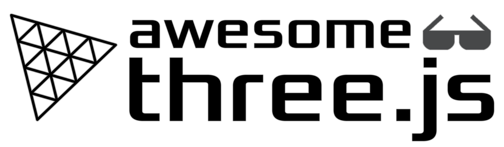

     
    
    <h1>Awesome Threejs </h1>
    

    <b>3️⃣ 精選的 ThreeJS 資源列表</b>
    

＃ 內容

- [核心](#Core)
- [書籍](#Books)
- [課程](#Courses)
- [文章](#Articles)
- [視頻](#Videos)
- [靈感](#Inspiration)
- [資源](#Resources)
- [工具](#Tools)
- [庫](#Libraries)
- [社區](#Community)
- [演示](#Demonstrations)
- [其他](#其他)
＃ 核

- [ThreeJS官網](https://threejs.org/)
- [ThreeJS 示例](https://threejs.org/examples/#webgl_animation_keyframes)
- [ThreeJS 文檔](https://threejs.org/docs/index.html#manual/en/introduction/Creating-a-scene)

# 書籍

## 3D 理論

- [3D Math Primer for Graphics and Game Development](https://gamemath.com/book/intro.html)：必讀書籍
  熟悉 3D 數學。通過 [@ZPostFacto](https://twitter.com/ZPostFacto)
  & [@Ian-Parberry](https://github.com/Ian-Parberry)
- [Physically Based Rendering - From Theory to Implementation](https://pbr-book.org/)：PBR 概念方面的參考。一座金礦。通過 [@mmp](https://github.com/mmp)、[@wjakob](https://github.com/wjakob) 和 [@humper](https://twitter.com/humper)

## 創意編碼
- [The Nature of Code](https://natureofcode.com/)：一位非常有趣的作者寫的一本很棒的書，講述了一堆基於 [@shiffman](https:// github.com/shiffman）

## 三個JS

- [發現三.js](https://discoverthreejs.com/)
- [學習 Three.js - 第三版](https://www.packtpub.com/product/learn-three-js-third-edition/9781788833288)

＃ 培訓班

## 三個JS

- [ThreeJS Journey](https://threejs-journey.com/)：一門很棒的課程，適合最初學者的程序員
  想學習如何從頭開始製作 ThreeJS 3D 體驗。通過 [@bruno_simon](https://twitter.com/bruno_simon)

## 著色器

- [學習 GLSL 的最簡單方法](https://simondev.teachable.com/p/glsl-shaders-from-scratch)
  通過 [@iced_coffee_dev](https://twitter.com/iced_coffee_dev)
- [The Book of Shaders](https://thebookofshaders.com/)：掌握著色器之路的參考。而且是免費的。
  通過 [@patriciogv](https://twitter.com/patriciogv)

# 文章

## 文檔

- [ThreeJS 基礎知識](https://threejs.org/manual/#en/fundamentals)
- [OpenGL 著色器](https://shaderific.com/index.html)：關於 GLSL 的文檔
- [GLSL 文檔](https://docs.gl/sl4/clamp)

## 3D 理論

- [解釋齊次坐標和射影幾何](https://www.tomdalling.com/blog/modern-opengl/explaining-homogenous-coordinates-and-projective-geometry/)：
  很全面的齊次坐標和射影幾何的文章（終於明白什麼是4th
  頂點著色器中的坐標 (w)）

## 教程

- [Three.js 中的表面採樣](https://tympanus.net/codrops/2021/08/31/surface-sampling-in-three-js/)：綜合
  關於 MeshSurfaceSampler 的文章
- [如何使用 WebGL 創建假 3D 圖像效果](https://tympanus.net/codrops/2019/02/20/how-to-create-a-fake-3d-image-effect-with-webgl/ ):
  一篇學習如何在 ThreeJS 中向 2D 圖像添加假深度的好文章。
- [矩陣教程](http://www.opengl-tutorial.org/beginners-tutorials/tutorial-3-matrices/)：清晰的教程
  了解著色器投影、視圖和模型矩陣（具有視覺衝擊力）

＃＃ 水

- [水焦散的實時渲染](https://medium.com/@martinRenou/real-time-rendering-of-water-caustics-59cda1d74aa) 焦散渲染的巧妙方法
- [實時流體模擬](https://shahriyarshahrabi.medium.com/gentle-introduction-to-fluid-simulation-for-programmers-and-technical-artists-7c0045c40bac) 很棒的文章，適合想要創建真正逼真的人水

## 生成藝術

- [生成藝術教程](https://generativeartistry.com/tutorials/)：非常棒的進化教程
  通過 [@rumyra](https://github.com/rumyra) 獲得一些關於生成藝術的知識
  & [@tholman](https://github.com/tholman)

＃＃ 碰撞檢測

- [邊界體積碰撞檢測](https://developer.mozilla.org/en-US/docs/Games/Techniques/3D_collision_detection/Bounding_volume_collision_detection_with_THREE.js)
- [基於物理的碰撞檢測](https://medium.com/@bluemagnificent/collision-detection-in-javascript-3d-physics-using-ammo-js-and-three-js-31a5569291ef)

＃ 靈感

＃＃ 常見的

- [same.energy](https://same.energy/)：通過關鍵詞或圖片的視覺搜索引擎（有點像Pinterest）
- [Pinterest](https://www.pinterest.fr/)：很好的靈感來源

## 著色器

- [ShaderToy](https://www.shadertoy.com/)：準備好被這個著色器共享平台震撼吧。

# 影片

## 著色器

- [ShaderShop 視頻](http://tobyschachman.com/Shadershop/)：一些關於 ShaderShop 的精彩視頻等等。
  通過 [@mandy3284](https://twitter.com/mandy3284)

＃ 資源

## 墊帽

- [Matcap 存儲庫](https://github.com/nidorx/matcaps)

## 3D 資產

- [Poliigon](https://www.poliigon.com/)：3D 藝術家的資產（紋理、模型、HDRI）
- [Poly Haven](https://polyhaven.com/)：公共 CC0 3D 資源庫（紋理、模型、HDRI）

## 紋理

- [3D 紋理](https://3dtextures.me/)：具有漫反射、法線、位移、遮擋、鏡面反射的免費 PBR 紋理
  和粗糙度圖。
- [Arroway Textures](https://www.arroway-textures.ch/)：用於 3D 渲染和實時使用的數字紋理。
- [ambientCG](https://ambientcg.com/): - 用於基於物理的渲染的 CC0 紋理

## GLSL 著色器
＃＃＃ 主要的
- [信號整形函數](https://iquilezles.org/articles/functions/)：一組有用的信號整形模式（以
  [@iquilezles](https://twitter.com/iquilezles) 轉換為 GLSL）
- [整形函數](http://www.flong.com/archive/texts/code/): 一組很棒的著色器整形函數
  通過 [@golan](https://twitter.com/golan)
- [曲線備忘單](https://www.flickr.com/photos/kynd/9546075099/)：關於如何製作一些信號的快速提醒
  [@kyndinfo](https://twitter.com/kyndinfo) 的模式
- [GLSL Noises](https://gist.github.com/patriciogonzalezvivo/670c22f3966e662d2f83): 別人編碼的噪音，所以你
  可以直接在你的著色器中使用它們來獲得很酷的效果（包括：Perlin 噪聲）
- [逼真的水著色器](https://github.com/jbouny/ocean) 還有一些鏈接解釋了方法
＃＃＃ 其他
- [PixelSpirit Elements Deck](https://pixelspiritdeck.com/)：這是學習GLSL著色器的塔羅牌。每個 PixelSpirit 卡都有一個視覺元素及其 GLSL 著色器代碼。這些卡片按從最簡單到最複雜的順序排列，構建了一個代碼函數庫，這些函數庫像一本咒語書一樣組合在一起，形成了一種無限的視覺語言。通過 [@patriciogv](https://twitter.com/patriciogv)
  - [PixelSpirit GitHub](https://github.com/patriciogonzalezvivo/PixelSpiritDeck) 與 [@patriciogv](https://twitter.com/patriciogv) 的 PixelSpirit Elemens Deck 相關的庫
  
＃ 工具

## 場景創建

- [Polygonjs](https://polygonjs.com): 基於節點的WebGL設計工具，用於程序幾何、粒子、材質
  和動畫。

## 3D建模

- [Blender](https://www.blender.org/)：免費且功能強大，可創建您自己的 3D 資產。很多導出文件擴展名
  可用。
- [Houdini](https://www.sidefx.com/products/houdini/)：創建程序 3D 資產。免費許可“Houdini
  學徒”
  可以用來學習（禁止商用）
- [Spline](https://spline.design/)：一種很有前途的協作式 3D 建模工具。

＃＃ 材料

- [Adobe Substance3D 套件](https://www.adobe.com/fr/products/substance3d/3d-augmented-reality.html)

## 立方體紋理

- [HDRI-to-CubeMap](https://matheowis.github.io/HDRI-to-CubeMap/)：一種將 HDRI 文件轉換為立方體貼圖的工具
  可以在 ThreeJS 中作為 CubeTexture 加載。通過 [@matheowis](https://github.com/matheowis)

## 著色器
###在線工具
- [GraphToy](https://graphtoy.com/)：強大的工具，可以讓你的大腦環繞並測試 GLSL 中的整形信號
  通過 [@iquilezles](https://twitter.com/iquilezles)
- [ShaderShop 編輯器](http://tobyschachman.com/Shadershop/editor/)：具有視覺衝擊力的編輯器，用於塑造
  信號，通過拖放模式。（非常棒）來自 [@mandy3284](https://twitter.com/mandy3284)
  
### 安裝的工具
- [glslViewer](https://github.com/patriciogonzalezvivo/glslViewer)：用於 2D/3D 著色器的基於控制台的 GLSL 沙箱，由 [@patriciogv](https://twitter.com/patriciogv) 提供。它經過其創建者的實戰測試，能夠構建與目標平台無關的創意管道，並且可以非常快速地迭代，並且在製作著色器創意草稿時摩擦更少。您工具包中的必備品。

## 沙箱

- [codesandbox](https://codesandbox.io/)：用於實驗和與人分享的沙盒。ThreeJS模板可以很方便
  成立。
- [codepen](https://codepen.io/)：發現很難為 ThreeJS x Typescript 配置，但是一個很好的沙箱來嘗試新的
  事物。
- [threejs-editor](https://threejs.org/editor/)：一個很好的工具，例如，可以嘗試你的 Blender 導出以及它們是如何導出的
  將在 ThreeJS 中做出反應。

## 託管

- [vercel](https://vercel.com/)：託管項目的簡單工具，個人/愛好者類型的項目免費。

# 庫
## GLSL/HLSL 著色器
- [lygia](https://github.com/patriciogonzalezvivo/lygia)：一個顆粒狀的多語言著色器庫，由 [@patriciogv](https://twitter.com/patriciogv) 設計，旨在提高性能和靈活性。一個跨平台庫，可幫助您非常輕鬆地迭代著色器。深入研究特定功能的代碼也可以幫助您學習 GLSL/HLSL。

## 相關框架

### 反應

- [react-three-fiber](https://github.com/pmndrs/react-three-fiber)：一種處理 ThreeJS 內容的聲明方式
  由 [@pmndrs](https://github.com/pmndrs) 做出反應
- [drei](https://github.com/pmndrs/drei)：[@pmndrs](https://github.com/pmndrs) 的 react-three-fiber 的有用助手

### 角度

- [angular-three](https://github.com/nartc/angular-three)：受 r3f 啟發的用於 Angular 生態系統的聲明式 ThreeJS
  通過 [@nartc](https://github.com/nartc)

### 視圖

- [trois](https://github.com/troisjs/trois)：相當於 [@troisjs](https://github.com/troisjs) 的 VueJS r3f

### 苗條

- [threlte](https://github.com/grischaerbe/threlte)：Svelte 的 three.js 組件庫。
- [svelte-cubed](https://github.com/Rich-Harris/svelte-cubed)：Svelte 的聲明式 ThreeJS
  通過 [@Rich-Harris](https://github.com/Rich-Harris)

##物理

- [@pmndrs](https://github.com/pmndrs/) [cannon-es](https://github.com/pmndrs/cannon-es)
- [Ammo.js](https://github.com/kripken/ammo.js/)
- [Oimo.js](https://lo-th.github.io/Oimo.js/#basic)
- [Rapier](https://github.com/dimforge/rapier) [@dimforge](https://github.com/dimforge/)

## 空間查詢和光線投射

- [three-mesh-bvh](https://github.com/gkjohnson/three-mesh-bvh) by [@gkjohnson](https://github.com/gkjohnson/)：檢查碰撞的高效方法並通過使用邊界體積層次結構來加速光線投射。（真的是您工具包中的必備品）

## 建設性的立體幾何

- [three-bvh-csg](https://github.com/gkjohnson/three-bvh-csg) by [@gkjohnson](https://github.com/gkjohnson/)：一種靈活、內存緊湊、快速以及在 three-mesh-bvh 之上的動態 CSG 實現。（用於在網格之間執行一些布爾運算的神奇工具，如交集、差分......）

＃＃ 尋找路徑

- [Pathfinging.js](https://github.com/qiao/PathFinding.js) 具有大量設置的有用庫
- [Three-pathfinging](https://github.com/donmccurdy/three-pathfinding) Three.js 導航插件
- [Kompute](https://github.com/oguzeroglu/Kompute) 易於使用的轉向庫

＃＃ 人物

- [ossos](https://github.com/sketchpunklabs/ossos) 一個完整的網絡角色蒙皮和動畫庫
- [mannequin.js](https://boytchev.github.io/mannequin.js/) 程序字符生成庫。包括電樞

# 示範

＃＃ 水

- [fft-ocean](https://github.com/jbouny/fft-ocean) Three.js 的快速傅里葉變換海洋渲染
- [skunami.js](https://github.com/skeelogy/skunami.js/) 具有逼真的水互動的奇妙項目
- [Shallow water](https://vuoriov4.github.io/webgl-water-demo/) 展示水波紋效果的Demo項目

＃＃ 碰撞檢測

- [軸對齊邊界框](https://github.com/mozdevs/gamedev-js-3d-aabb) 基於 AABB 的碰撞檢測
- [基於光線的碰撞檢測](http://stemkoski.github.io/Three.js/Collision-Detection.html)

＃ 社區

＃＃ 核

- [Stackoverflow ThreeJS](https://stackoverflow.com/questions/tagged/three.js)：您可以提出問題的論壇（
  之前一定要搜索好）
- [官方 ThreeJS Discord](https://discord.com/invite/56GBJwAnUS)
- [ThreeJS 官方論壇](https://discourse.threejs.org/)
- [官方 Slack](https://join.slack.com/t/threejs/shared_invite/zt-rnuegz5e-FQpc6YboDVW~5idlp7GfDw)
- [官方推特](https://twitter.com/threejs)
- [官方 Reddit](https://www.reddit.com/r/threejs/)
＃ 貢獻

歡迎投稿！首先閱讀 [貢獻指南](contributing.md)。

或者你可以在 Twitter 上聯繫我：

# 相關列表

- [awesome-glsl](https://github.com/vanrez-nez/awesome-glsl) - 精選的 GLSL 資源列表。
- [awesome-webgl](https://github.com/sjfricke/awesome-webgl) - 精選的 WebGL 庫、資源和
  多得多。
- [awesome-webgpu](https://github.com/mikbry/awesome-webgpu) - 很棒的 WebGPU 資源的精選列表。
- [awesome-opengl](https://github.com/eug/awesome-opengl) - 精選的 OpenGL 庫、調試器和
  資源。
- [awesome-creative-coding](https://github.com/terkelg/awesome-creative-coding) - 精心策劃的精彩列表
  主要針對初學者/中級的創意編碼資源。
- [awesome-computer-vision](https://github.com/jbhuang0604/awesome-computer-vision) - 很棒的計算機精選列表
  視覺資源。
- [awesome-vulkan](https://github.com/vinjn/awesome-vulkan) - 精選的 Vulkan 項目和生態系統列表。
- [gamedev](https://github.com/ellisonleao/magictools) - 關於遊戲開發的精彩列表。
- [graphics-resources](https://github.com/mattdesl/graphics-resources) - 圖形編程資源列表。